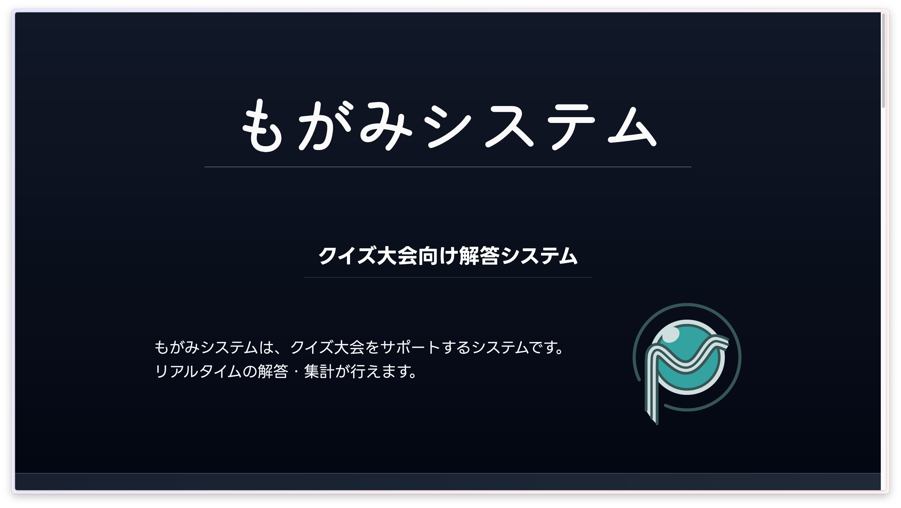
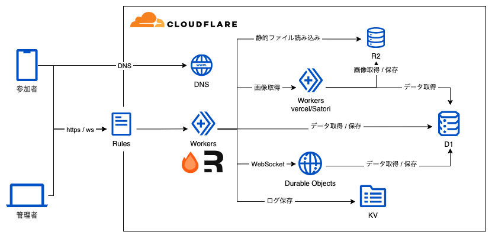

# Cloudflareだけで
# Webアプリを作成してみた
## おがどら

---

## はじめに

写真撮影はご遠慮ください 🙇

---

## こんなアプリケーションを作りました




---

## システム概要

- クイズを出題、解答できるアプリ
  - リアルタイム解答、集計
- 数百人規模に対応
  - 250人まで負荷試験を実施
- 結果をOGPつきでツイートできる

---

## こんなアーキテクチャで動いています



---

## システムのポイント

- Rules, Workersによる前処理
  - Rulesによってヘッダ付与
  - フロントエンド、WebSocket共通処理

- Durable Objectsをフル活用！
  - WebSocket通信
  - クイズ進行状況の保持

---

## Rules, Workersによる前処理

- Rulesでヘッダ付与
  - リクエスト元Port番号をRulesで付与
  - プロバイダ責任制限法に対応するため保存
- その他、Honoを用いた共通処理
  - クイズ管理画面へのアクセス制限

---

## Durable Objectsをフル活用！

- serializeAttachementによりsocketから属性を取得
- acceptWebSocketにより属性からsocketを取得
- strageに進行状況を保存・取得

---

## ユーザー接続処理

```ts {*|3-7}
const pair = new WebSocketPair();
const [client, server] = Object.values(pair);
// ソケットに情報を埋め込み
server.serializeAttachment({
  id: userId,
  name: userName,
});

this.state.acceptWebSocket(server, [
  UserType.Answerer,
  userId,
]);

```

---

## ユーザー接続処理

```ts {6-8}

private async webSocketMessage(
    socket: WebSocket,
    rawMessage: string | ArrayBuffer,
) {
    const message = JSON.parse(rawMessage.toString());
    const user = socket.deserializeAttachment();
    console.log(user);
    // { id: userId, name: userName }
}
```

---

## ユーザー接続処理

```ts {9-12}

const pair = new WebSocketPair();
const [client, server] = Object.values(pair);
// ソケットに情報を埋め込み
server.serializeAttachment({
  id: userId,
  name: userName,
});

this.state.acceptWebSocket(server, [
  WebSocketUserType.Answerer,
  userId,
]);
```

---

## ユーザー接続処理

```ts {1-4|6-9|11-14}

// 解答者全員に対してメッセージを送信
this.state.getWebSockets(UserType.Answerer).map((ws) => {
    this.webSocketResSend(ws, message);
});

// 特定のユーザーに対してメッセージを送信
this.state.getWebSockets(userId).map((ws) => {
    this.webSocketResSend(ws, message);
});

// 全員に対してメッセージを送信
this.state.getWebSockets().map((ws) => {
    this.webSocketResSend(ws, message);
});
```

---

## Durable Objects

- pros 😄
  - 安い
  - やりたいことは何でもできた
- cons 😭
  - なんでもできる
  - 神クラスが降臨されました(2000行超)

---

ご清聴ありがとうございました

- Twitter: [@const_myself](https://twitter.com/const_myself)
- GitHub: [ogadra](https://github.com/ogadra)

made by Slidev

<PoweredBySlidev mt-10 />
