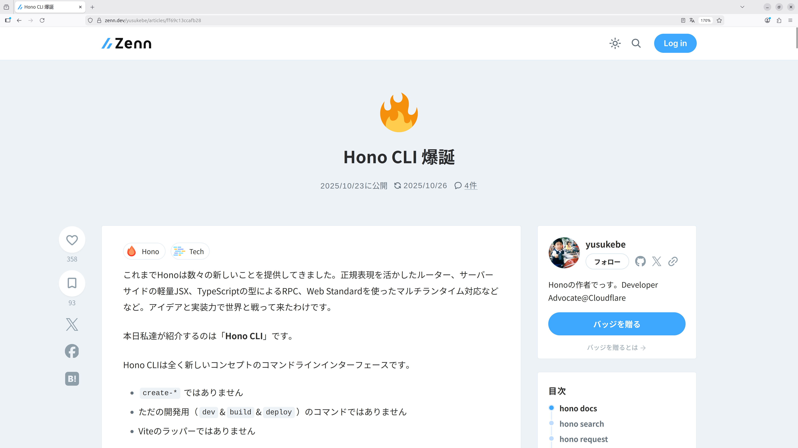

<div style="height: 100px"/>

# 実行可能な
# スライドを作る

<div style="height: 30px" />

## ogadra


---

## 我々はなぜ登壇するのか

<div class="center-content">

知見・経験を共有したいから

</div>

---

## 知見の共有「だけ」で満足？

<div class="center-content">

聞いて終わる話は「忘れられる」

=> 実際に「手を動かして」もらいたい

</div>

---

## そんなこと、できるの？

<div class="center-content">

- PCを持参 -> 環境構築？
- LTは5分しかない

</div>

---

## だから「実行可能な」スライドを作る

<div class="center-content">

登壇中に全員が「試せる」環境を

スライドに「埋め込む」

</div>

---

<div style="display: flex; align-items: center; justify-content: center; height: 100%; min-height: 500px;">
<p style="font-size: 10em !important; font-weight: bold; background: linear-gradient(90deg, #f87171, #fb923c, #fbbf24, #4ade80, #60a5fa, #818cf8, #c084fc, #f87171); background-size: 400% 100%; -webkit-background-clip: text; -webkit-text-fill-color: transparent; animation: rainbow 3s linear infinite;">デモLT</p>
</div>

---

<div style="height: 100px"/>

# 5分後。
# あなたはHono CLI経験者

<div style="height: 50px"/>

## ogadra

---

## Hono CLI触ったことのある方、挙手！

<div class="center-content">

今日は全員の挙手を目標とします

</div>

---

## QR

<!-- QR -->


---

## hono/cliのインストール

npmでインストールできます！

<CodeBlock
  code="npm install -g @hono/cli"
  lang="bash"
/>

※ インストールに1分ほどかかることがあります

---

## Hono CLIとは

<div>
  
  </div>
  <div class="flex flex-wrap w-full mx-auto">
  <span class="text-center mx-auto">
  https://zenn.dev/yusukebe/articles/ff69c13ccafb28</span>
</div>

---

## Hono CLIとは

<p style="font-size: 2em !important; margin-bottom: 0.5rem; width: 100%; text-align: center; margin: 20px auto;"><span style="background: linear-gradient(transparent 60%, rgba(74, 222, 128, 0.6) 60%); font-weight: bold;">人間</span>と<span style="background: linear-gradient(transparent 60%, rgba(96, 165, 250, 0.6) 60%); font-weight: bold;">AI</span>のためのCLI</p>

<div style="display: flex; gap: 1.5rem; justify-content: center; margin-top: 0.5rem;text-align: center;">
  <div style="background: rgba(74, 222, 128, 0.15); border: 1px solid #4ade80; border-radius: 8px; padding: 0.5rem 1rem 3rem 1rem; width: 450px;">
    <p style="font-size: 2em !important; color: #4ade80; margin-bottom: 0.5rem; border-bottom: 2px solid #4ade80; padding-bottom: 0.3rem;">人間</p>
    <p style="font-size: 1.5em !important; line-height: 1.5 !important; margin: 0;">動作確認する</p>
    <p style="font-size: 1.5em !important; line-height: 1.5 !important; margin: 0;">最適化する</p>
  </div>
  <div style="background: rgba(96, 165, 250, 0.15); border: 1px solid #60a5fa; border-radius: 8px; padding: 0.5rem 1rem 3rem 1rem; width: 450px;">
    <p style="font-size: 2em !important; color: #60a5fa; margin-bottom: 0.5rem; border-bottom: 2px solid #60a5fa; padding-bottom: 0.3rem;">AI</p>
    <p style="font-size: 1.5em !important; line-height: 1.5 !important; margin: 0;">ドキュメントを読む</p>
    <p style="font-size: 1.5em !important; line-height: 1.5 !important; margin: 0;">動作確認する</p>
  </div>
</div>

---

## hono request

<ScrollableContent maxHeight="380px">


ソースコード

<CodeBlock
  code="import { Hono } from 'hono'
const app = new Hono()
app.get('/', (c) => c.text('Hello World'))
export default app"
  lang="TypeScript"
  filename="example-1/index.ts"
/>

実行コマンド `hono request`

<CodeBlock code="hono request -P / example-1/index.ts" lang="bash" />

</ScrollableContent>


---

## hono serve

<SplitView leftWidth="500px">
<ScrollableContent maxHeight="380px">

ソースコード

<CodeBlock
  code="import { Hono } from 'hono';
import { Page } from './page';
const app = new Hono<{
  Variables: { count: number; };
}>();
let counter = 0;
app.get('/', (c) => {
  counter++;
  c.set('count', counter);
  return Page(c);
});
export default app;"
  lang="TypeScript"
  filename="example-2/index.ts"
/>

実行コマンド `hono serve`

<CodeBlock code='hono serve example-2/index.ts' lang="bash" />

実行を強制終了するコマンド

<CodeBlock
  code='lsof -ti:7070 | xargs kill -9'
  lang="bash"
  maxWidth="500px"
/>

ログも出せます

<CodeBlock code='hono serve example-2/index.ts \
  --use "logger()"' lang="bash" />

</ScrollableContent>
</SplitView>


---

## Hono CLI触ったことのある方、挙手！

<div class="center-content">

ね、簡単でしょ？

</div>


---
layout: image-x
image: https://media.ogadra.com/misskey/drive/b7f08bb1-df92-45c3-855d-521eb9859015.gif
imageOrder: 2
---

## Thank you for listening!

Done is better than perfect.

- Twitter: [@const_myself](https://twitter.com/const_myself)
- GitHub: [ogadra](https://github.com/ogadra)

<PoweredBySlidev mt-10 />

---

## というわけで

<div class="center-content">

<p style="font-size: 1.7em !important; font-weight: bold;">
  <span style="background: linear-gradient(transparent 60%, rgba(74, 222, 128, 0.5) 60%);">「実行可能なスライド」</span>を作ってきました
</p>

</div>

---

## 技術スタック

<div style="display: flex; gap: 1rem; justify-content: center; align-items: stretch; margin-top: 4.5rem;">
  <div style="background: rgba(251, 146, 60, 0.15); border: 1px solid #fb923c; border-radius: 8px; padding: 1.5rem 1rem; width: 260px; text-align: center;">
    <p style="font-size: 1.2em !important; color: #fb923c; margin-bottom: 0.5rem; font-weight: bold;">Cloudflare Workers</p>
    <p style="font-size: 1em !important; color: #ccc; margin: 0;">ルーティング</p>
  </div>
  <div style="background: rgba(96, 165, 250, 0.15); border: 1px solid #60a5fa; border-radius: 8px; padding: 1.5rem 1rem; width: 260px; text-align: center;">
    <p style="font-size: 1.2em !important; color: #60a5fa; margin-bottom: 0.5rem; font-weight: bold;">Durable Objects</p>
    <p style="font-size: 1em !important; color: #ccc; margin: 0;">スライド同期<br/>コンテナ保存</p>
  </div>
  <div style="background: rgba(74, 222, 128, 0.15); border: 1px solid #4ade80; border-radius: 8px; padding: 1.5rem 1rem; width: 260px; text-align: center;">
    <p style="font-size: 1.2em !important; color: #4ade80; margin-bottom: 0.5rem; font-weight: bold;">Sandbox SDK</p>
    <p style="font-size: 1em !important; color: #ccc; margin: 0;">コンテナでの<br/>コマンド実行</p>
  </div>
</div>


---

## Sandbox SDKとは

<div style="display: flex; flex-direction: column; align-items: center; justify-content: center; min-height: 320px; text-align: center;">

<p style="font-size: 1.8em !important; margin-bottom: 1rem;">Cloudflare上のSandbox環境</p>
<p style="font-size: 1.5em !important; color: #ccc; margin-bottom: 2rem;">Dockerコンテナ内で<span style="border-bottom: 2px solid #4ade80;">任意コマンド</span>を実行できる</p>
<a style="font-size: 1.1rem !important; color: #888;" href="https://sandbox.cloudflare.com/">https://sandbox.cloudflare.com/</a>

</div>


---

## 例

DockerにあるPythonのバージョンを確認する

```ts{4}
app.post("/sandbox", async(c: Context, env: Env) => {
  const sandbox = getSandbox(env.Sandbox, 'user-123');

  const result = await sandbox.exec('python --version');
  return Response.json({
    output: result.stdout,
    exitCode: result.exitCode,
    success: result.success
  });
});

```
任意コードを1行で実行できる

---

## 今回のデモだとこんな感じ

コマンド実行時にはプロセスIDを返却

```ts{6,7}
app.post("/sandbox/:slide", async(c: Context, env: Env) => {
  const slide = c.req.param("slide");
  const { code } = await c.req.json();

  const sandbox = getSandbox(env.Sandbox, slide);
  const process = await sandbox.startProcess(code);
  return Response.json({ processId: process.id });
});

```

---

## 今回のデモだとこんな感じ

GetリクエストでStream返却

```ts{6-13}
app.get("/sandbox/:slide/stream", async(c: Context) => {
  const slide = c.req.param("slide");
	const processId = c.req.query("processId");

	const sandbox = getSandbox(c.env.Sandbox, slide);
	const stream = await sandbox.streamProcessLogs(processId);
	return new Response(stream, {
		headers: {
			"Content-Type": "text/event-stream",
			"Cache-Control": "no-cache",
			Connection: "keep-alive",
		},
	});
})

```

---

## 苦労したこと

<p style="font-size: 1.2em !important; margin-bottom: 1.5rem;">
workersのカスタムドメイン<code>example.com</code>に対して<code>*.example.com/*</code>のRoute設定が必要
</p>

<div style="display: flex; gap: 1.5rem; justify-content: center; margin-top: 1rem;">
  <div style="background: rgba(148, 163, 184, 0.1); border: 1px solid #94a3b8; border-radius: 8px; padding: 1.2rem 1.5rem; width: 380px;">
    <p style="font-size: 1.1em !important; color: #94a3b8; margin-bottom: 0.5rem; font-weight: bold;">カスタムドメインが必要</p>
    <p style="font-size: 0.95em !important; color: #aaa; margin: 0;">*.workers.devのサブドメイン不可</p>
  </div>
  <div style="background: rgba(251, 191, 36, 0.1); border: 1px solid #fbbf24; border-radius: 8px; padding: 1.2rem 1.5rem; width: 380px;">
    <p style="font-size: 1.1em !important; color: #fbbf24; margin-bottom: 0.5rem; font-weight: bold;">サブドメインでやる場合</p>
    <p style="font-size: 0.95em !important; color: #aaa; margin: 0;">「Advanced Certificate Manager」<br/>月額10ドル</p>
  </div>
</div>

---
layout: image-x
image: https://media.ogadra.com/misskey/drive/b7f08bb1-df92-45c3-855d-521eb9859015.gif
imageOrder: 2
---

## Thank you for listening!

Done is better than perfect.

- Twitter: [@const_myself](https://twitter.com/const_myself)
- GitHub: [ogadra](https://github.com/ogadra)

<PoweredBySlidev mt-10 />

