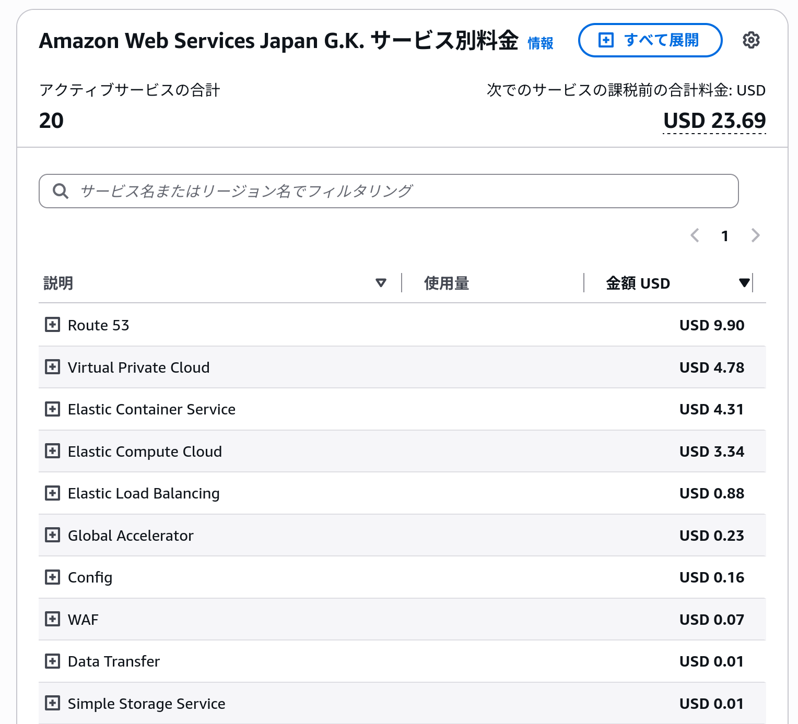
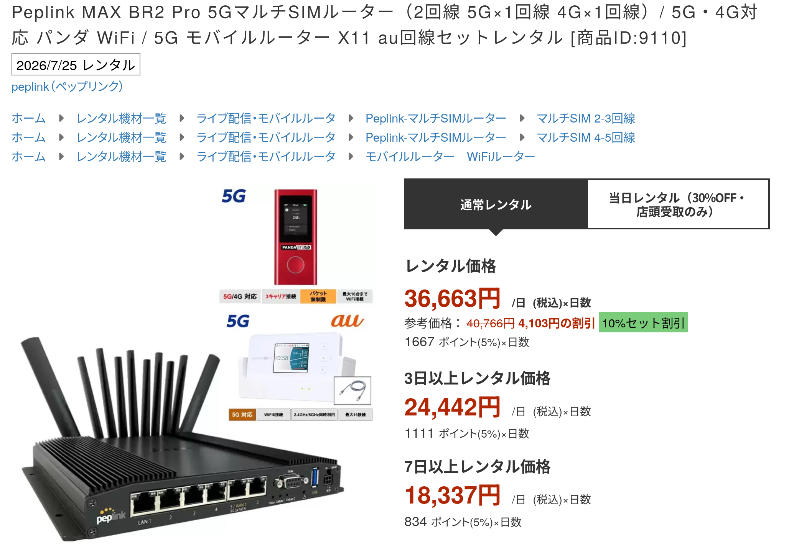

<TitleSlide
  :lines="['実録!', 'コストとアクセスログ']"
  accent="結果発表!"
  speaker="ogadra"
  event="[非公式] キチピーふりかえり会"
/>

---

<StatementSlide>

アクセスログ結果発表

</StatementSlide>

---

<ProblemActionSlide>
  <template #problem>
    アーキテクチャ振り返り
  </template>
  <template #action>
    [初回接続] 参加者ごとにランダムなサーバーにアクセスする  
    [次回以降] 初回接続したサーバーにアクセスする(cookie依存)
  </template>
</ProblemActionSlide>

---

<ProblemActionSlide>
  <template #problem>
    リソース割り振り状況 (17:25 ~ 17:30)
  </template>
  <template #action>

  |  | AWS | Google Cloud | 合計 |
  |---|---|---|---|
  | 東京 | 69 | 56 | 125 |
  | 大阪 | 16 | 15 | 31 |
  | 合計 | 85 | 71 | 156 |

  </template>
</ProblemActionSlide>

---

<ProblemActionSlide>
  <template #problem>
    別のリージョンに飛んだら？
  </template>
  <template #action>

  <TransferDiagram />

  AWS 東京に飛びがちでした

  </template>
</ProblemActionSlide>

---

<ProblemActionSlide>
  <template #problem>
    サーバー枯渇による意図的な大阪割り当て
  </template>
  <template #action>

  AWS 東京で用意したコンテナ数は70 
  コンテナ割り当てをAWS 大阪にフォールバックさせた(12件)

  </template>
</ProblemActionSlide>

---

<StatementSlide>

コスト発表

</StatementSlide>

---

<ProblemActionSlide>
  <template #problem>
    主にコストはどこに掛かったのか？
  </template>
  <template #action>

  - ドメイン
  - IBM NS1 Connect
  - AWS
  - Google Cloud
  - ルーター (レンタル)
  - Tシャツ
  - Claude Code

  </template>
</ProblemActionSlide>

---

<ProblemActionSlide>
  <template #problem>
    ドメイン取得？
  </template>
  <template #action>

  普段は `ogadra.com` のサブドメインを用いている  
  Cloudflareにある `ogadra.com` では要件を満たせないため  
  3,038円 (18.7ドル)
  </template>
</ProblemActionSlide>

---

<ProblemActionSlide>
  <template #problem>
    IBM NS1 Connect
  </template>
  <template #action>

  かくかくしかじかでDNS用に契約する必要があった  
  15,800円 / 月掛かる  
  無料評価期間(1ヶ月)内に構築と本番を済ませた  
  0円

  </template>
</ProblemActionSlide>

---

<ProblemActionSlide :media-width="730">
  <template #problem>
    AWS
  </template>
  <template #action>

  Route 53に一番コストが掛かっています 
  Route 53 Resolver Endpointが 
  全体の約1/3 
  4,271円 (26.06ドル)

  </template>
  <template #media>
    
  </template>
</ProblemActionSlide>

---

<ProblemActionSlide>
  <template #problem>
    Google Cloud
  </template>
  <template #action>
    6,000 ~ 10,000円くらい？
  </template>
</ProblemActionSlide>

---

<ProblemActionSlide :media-width="860">
  <template #problem>
    Wi-Fi ルーター
  </template>
  <template #action>

  ボンディングルーターという代物 
  複数の携帯回線を束ねて 
  冗長化通信してくれる 
  40,329円 (1日)

  </template>
  <template #media>
    
  </template>
</ProblemActionSlide>

---

<ProblemActionSlide :media-width="665">
  <template #problem>
    LTは5分 Tシャツ
  </template>
  <template #action>

  本番一週間前に気がついて、お急ぎ便で注文 
  6,061円

  </template>
  <template #media>
    
  </template>
</ProblemActionSlide>

---

<ProblemActionSlide :media-width="665">
  <template #problem>
    Claude Max 20x
  </template>
  <template #action>

  説明不要 
  37,212円 (220ドル)

  </template>
</ProblemActionSlide>

---

<ProblemActionSlide>
  <template #problem>
    合計
  </template>
  <template #action>
    90,911円 + Google Cloud請求料金
  </template>
</ProblemActionSlide>

---

<HaikuSlide :lines="['買えぬもの', '会場内の', '盛り上がり']" />

---

<ProfileSlide
  name="ogadra"
  avatar="https://media.ogadra.com/misskey/drive/b7f08bb1-df92-45c3-855d-521eb9859015.gif"
  :lines="['twitter.com/const_myself', 'github.com/ogadra', 'slide.ogadra.com']"
/>
