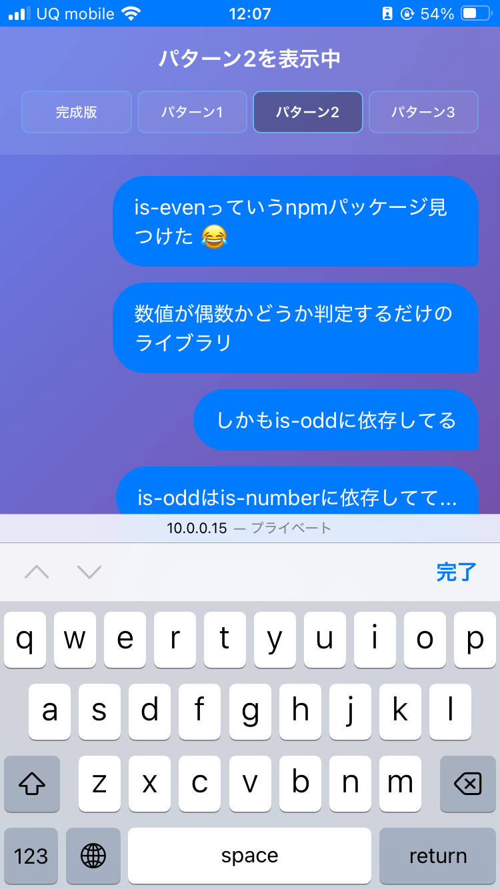

<style>
.slidev-layout {
  padding-top: 0 !important;
}

</style>

# Safariでもネイティブアプリの触り心地を
# 実現したい！
## ogadra

---
layout: image-x
image: https://media.ogadra.com/misskey/drive/b7f08bb1-df92-45c3-855d-521eb9859015.gif
imageOrder: 2
---

# ogadra

Motto: Done is better than perfect.

Favorite languages: TypeScript, Go

---

### スマホブラウザ対応と聞いて思い浮かべるもの

- Width / Heightが変わっても動く「レスポンシブデザイン」
- input要素のfont-sizeを16px以上にする
  - iOSブラウザでの意図せぬズームを防ぐ


<v-click>
  <div class="text-center text-4xl font-bold mt-16">
    それだけじゃない！という話をします
  </div>
</v-click>

---

### デモページ


<div class="text-center">

  [https://slide.ogadra.com/demo/ios-safari-app-experience](https://slide.ogadra.com/demo/ios-safari-app-experience)
</div>

---

### チャットアプリのようなUI

<div style="display: flex; align-items: center; gap: 2rem;">
  <div style="flex: 1;">
    <ul>
      <li>画面上部に、常にHeaderがある</li>
      <li>画面下部に入力欄 / 送信ボタンがある
        <ul>
          <li>Focusするとスマホではキーボードが出る</li>
          <li style="margin-left: 1rem;">キーボードがあるときは入力欄がせり上がる</li>
          <li>Focus解除でキーボード解除</li>
        </ul>
      </li>
      <li>Header / Form部分を除いた部分がスクロール可能</li>
    </ul>
  </div>
  <div style="display: flex; justify-content: center;">
    
  </div>
</div>

---

### 一見誰でも作れそうなUIですが…

<v-click>
  <div class="text-center text-6xl font-bold mt-36">
    落とし穴がいっぱい！
  </div>
</v-click>

---

#### 1: `position: fixed;`


<div style="display: flex; align-items: center; margin: 2rem 0;">
  <div style="flex: 1; display: flex; justify-content: center; perspective: 1200px;">
    <div style="width: 300px; height: 320px; position: relative; transform: rotateX(15deg) rotateY(-20deg) translateX(-30px) translateY(15px); transform-style: flat;">
    <div style="
      width: 100%;
      height: 100%;
      border: 4px solid #333;
      border-radius: 20px;
      background: #f8f9fa;
      position: absolute;
      box-shadow: 30px 30px 60px rgba(0,0,0,0.4);
      transform: translateZ(0px) translateX(0px);
      display: flex;
      align-items: center;
      justify-content: center;
      font-size: 0.7rem;
      color: #666;
      font-weight: bold;
    ">Device Frame</div>
    <div style="
      position: absolute;
      top: 4px;
      left: 4px;
      right: 4px;
      width: calc(100% - 8px);
      height: 60px;
      background: rgba(25, 118, 210, 0.4);
      border: 1px dashed rgba(25, 118, 210, 0.7);
      transform: translateZ(-5px);
      border-radius: 16px 16px 0 0;
      display: flex;
      align-items: center;
      justify-content: center;
      font-size: 0.6rem;
      color: #1976d2;
      font-weight: bold;
    ">Header padding area</div>
    <div style="
      position: absolute;
      top: 4px;
      left: 4px;
      right: 4px;
      height: 60px;
      background: linear-gradient(135deg, #1976d2 0%, #42a5f5 100%);
      color: white;
      display: flex;
      align-items: center;
      justify-content: center;
      font-size: 0.9rem;
      font-weight: bold;
      border-radius: 16px 16px 0 0;
      transform: translateX(-25px) translateY(-10px) translateZ(45px);
      box-shadow: 0 8px 16px rgba(0,0,0,0.3);
    ">Header (position: fixed;)</div>
    <div style="
      position: absolute;
      bottom: 4px;
      left: 4px;
      right: 4px;
      width: calc(100% - 8px);
      height: 50px;
      background: rgba(244, 67, 54, 0.4);
      border: 1px dashed rgba(244, 67, 54, 0.7);
      transform: translateZ(-5px);
      border-radius: 0 0 16px 16px;
      display: flex;
      align-items: center;
      justify-content: center;
      font-size: 0.6rem;
      color: #f44336;
      font-weight: bold;
    ">Footer margin area</div>
    <div style="
      position: absolute;
      bottom: 15px;
      left: 9px;
      right: 9px;
      height: 50px;
      background: #ffebee;
      border: 2px solid #f44336;
      display: flex;
      align-items: center;
      justify-content: center;
      font-size: 0.8rem;
      font-weight: bold;
      color: #c62828;
      transform: translateX(-30px) translateY(15px) translateZ(45px);
      border-radius: 0 0 16px 16px;
      box-shadow: 0 12px 24px rgba(244,67,54,0.4);
    ">Input (position: fixed;)</div>
    </div>
  </div>
  <div style="flex: 1; font-size: 1rem;">
    <div style="display: flex; gap: 0.5rem; margin-bottom: 1rem; justify-content: center;">
      <div style="background: linear-gradient(135deg, #ffebee 0%, #ffcdd2 100%); color: #c62828; padding: 0.5rem 1rem; border-radius: 1.5rem; font-weight: bold; font-size: 0.85rem; border: 2px solid #ef5350; display: flex; align-items: center; gap: 0.25rem;">
        🍎 iOS ❌
      </div>
      <div style="background: linear-gradient(135deg, #ffebee 0%, #ffcdd2 100%); color: #c62828; padding: 0.5rem 1rem; border-radius: 1.5rem; font-weight: bold; font-size: 0.85rem; border: 2px solid #ef5350; display: flex; align-items: center; gap: 0.25rem;">
        🤖 Android ❌
      </div>
    </div>
    <div style="background: #f5f5f5; padding: 0 1rem 1rem; border-radius: 0.5rem;">
      <h4 style="margin: 0 0 0.5rem 0; font-size: 1rem; color: #333;">問題点</h4>
      <div style="font-size: 0.85rem; color: #666; line-height: 1.4;">
        <strong style="color: #d32f2f;">iOS / Android:</strong> キーボード表示時にfixedなHeaderが画面外に移動する
      </div>
    </div>
  </div>
</div>

---

#### スクリーンショット & コード

<div style="display: flex; gap: 2rem; height: 420px;">
  <div style="width: 500px; display: flex; gap: 1rem; justify-content: center;">
    <div style="text-align: center;">
      <div style="color: #60a5fa; margin-bottom: 0.5rem; font-size: 0.9rem; font-weight: bold;">🍎 iOS Safari</div>
      
    </div>
    <div style="text-align: center;">
      <div style="color: #4ade80; margin-bottom: 0.5rem; font-size: 0.9rem; font-weight: bold;">🤖 Android Chrome</div>
      
    </div>
  </div>
  <div style="width: 400px; display: flex; flex-direction: column; justify-content: center;">

```css
.header {
  position: fixed;
  top: 0;
}

.footer {
  position: fixed;
  bottom: 0;
}
```

  </div>
</div>

---

#### 2: `position: absolute;` + innerHeight + meta viewport

<div style="display: flex; align-items: center; margin: 2rem 0;">
  <div style="flex: 1; display: flex; justify-content: center; perspective: 1200px;">
    <div style="width: 300px; height: 320px; position: relative; transform: rotateX(20deg) rotateY(-15deg) translateX(-30px) translateY(15px); transform-style: preserve-3d;">
      <div style="
        width: 100%;
        height: 100%;
        border: 4px solid #333;
        border-radius: 20px;
        background: #f8f9fa;
        position: absolute;
        box-shadow: 30px 30px 60px rgba(0,0,0,0.4);
        transform: translateZ(0px) translateX(0px);
        display: flex;
        align-items: center;
        justify-content: center;
        font-size: 0.7rem;
        color: #666;
        font-weight: bold;
      ">Device Frame</div>
      <div style="
        position: absolute;
        top: 4px;
        left: 4px;
        right: 4px;
        width: calc(100% - 8px);
        height: 60px;
        background: rgba(25, 118, 210, 0.4);
        border: 1px dashed rgba(25, 118, 210, 0.7);
        transform: translateZ(5px);
        border-radius: 16px 16px 0 0;
        display: flex;
        align-items: center;
        justify-content: center;
        font-size: 0.6rem;
        color: #1976d2;
        font-weight: bold;
      ">Header padding area</div>
      <div style="
        position: absolute;
        top: 4px;
        left: 4px;
        right: 4px;
        height: 60px;
        background: linear-gradient(135deg, #1976d2 0%, #42a5f5 100%);
        color: white;
        display: flex;
        align-items: center;
        justify-content: center;
        font-size: 0.9rem;
        font-weight: bold;
        border-radius: 16px 16px 0 0;
        transform: translateZ(30px) translateX(-6px);
        box-shadow: 0 8px 16px rgba(0,0,0,0.3);
      ">Header (fixed)</div>
      <div style="
        position: absolute;
        top: 60px;
        left: 4px;
        right: 4px;
        height: 207px;
        background: #e3f2fd;
        border: 2px solid #2196f3;
        display: flex;
        align-items: center;
        justify-content: center;
        font-size: 0.8rem;
        color: #424242;
        text-align: center;
      ">Main Content<br/>window.innerHeight - footer</div>
      <div style="
        position: absolute;
        bottom: 4px;
        left: 4px;
        right: 4px;
        width: calc(100% - 8px);
        height: 50px;
        background: rgba(255, 150, 0, 0.15);
        border: 2px solid #ff9800;
        display: flex;
        align-items: center;
        justify-content: center;
        font-size: 0.8rem;
        font-weight: bold;
        color: #e65100;
        border-radius: 0 0 16px 16px;
      ">Footer (absolute)</div>
    </div>
  </div>
  <div style="flex: 1; font-size: 1rem;">
    <div style="display: flex; gap: 0.5rem; margin-bottom: 1rem; justify-content: center;">
      <div style="background: linear-gradient(135deg, #ffebee 0%, #ffcdd2 100%); color: #c62828; padding: 0.5rem 1rem; border-radius: 1.5rem; font-weight: bold; font-size: 0.85rem; border: 2px solid #ef5350; display: flex; align-items: center; gap: 0.25rem;">
        🍎 iOS ❌
      </div>
      <div style="background: linear-gradient(135deg, #e8f5e8 0%, #c8e6c9 100%); color: #2e7d32; padding: 0.5rem 1rem; border-radius: 1.5rem; font-weight: bold; font-size: 0.85rem; border: 2px solid #4caf50; display: flex; align-items: center; gap: 0.25rem;">
        🤖 Android ⭕
      </div>
    </div>
    <div style="background: #f5f5f5; padding: 0 1rem 1rem; border-radius: 0.5rem;">
      <h4 style="margin: 0 0 0.5rem 0; font-size: 1rem; color: #333;">特徴</h4>
      <div style="font-size: 0.85rem; color: #666; line-height: 1.4;">
        <strong style="color: #d32f2f;">iOS:</strong> innerHeightが変わらないため、input要素がキーボードの裏に<br/>
        <strong style="color: #2e7d32;">Android:</strong> innerHeightがキーボードを考慮して変化し、input要素が見える<br/>
      </div>
    </div>
  </div>
</div>

---

#### スクリーンショット & コード

<div style="display: flex; gap: 2rem; height: 420px;">
  <div style="width: 500px; display: flex; gap: 1rem; justify-content: center;">
    <div style="text-align: center;">
      <div style="color: #60a5fa; margin-bottom: 0.5rem; font-size: 0.9rem; font-weight: bold;">🍎 iOS Safari</div>
      
    </div>
    <div style="text-align: center;">
      <div style="color: #4ade80; margin-bottom: 0.5rem; font-size: 0.9rem; font-weight: bold;">🤖 Android Chrome</div>
      
    </div>
  </div>
  <div style="width: 400px; display: flex; flex-direction: column; justify-content: center;">


```html
<!-- HTML -->
<meta name="viewport" 
  content="width=device-width,
    interactive-widget=resizes-content"
/>
```

```jsx
<main style={{
  `height:
    ${window.innerHeight
      - footerHeight
    }px`
  }}
>
  ...
</main>

```

  </div>
</div>

---

#### 3: `position: absolute;` + Viewport API

<div style="display: flex; align-items: center; margin: 2rem 0;">
  <div style="flex: 1; display: flex; justify-content: center; perspective: 1200px;">
    <div style="width: 300px; height: 320px; position: relative; transform: rotateX(20deg) rotateY(-15deg) translateX(-30px) translateY(15px); transform-style: preserve-3d;">
      <div style="
        width: 100%;
        height: 100%;
        border: 4px solid #333;
        border-radius: 20px;
        background: #f8f9fa;
        position: absolute;
        box-shadow: 30px 30px 60px rgba(0,0,0,0.4);
        transform: translateZ(0px) translateX(0px);
        display: flex;
        align-items: center;
        justify-content: center;
        font-size: 0.7rem;
        color: #666;
        font-weight: bold;
      ">Device Frame</div>
      <div style="
        position: absolute;
        top: 4px;
        left: 4px;
        right: 4px;
        width: calc(100% - 8px);
        height: 60px;
        background: rgba(25, 118, 210, 0.4);
        border: 1px dashed rgba(25, 118, 210, 0.7);
        transform: translateZ(5px);
        border-radius: 16px 16px 0 0;
        display: flex;
        align-items: center;
        justify-content: center;
        font-size: 0.6rem;
        color: #1976d2;
        font-weight: bold;
      ">Header padding area</div>
      <div style="
        position: absolute;
        top: 4px;
        left: 4px;
        right: 4px;
        height: 60px;
        background: linear-gradient(135deg, #1976d2 0%, #42a5f5 100%);
        color: white;
        display: flex;
        align-items: center;
        justify-content: center;
        font-size: 0.9rem;
        font-weight: bold;
        border-radius: 16px 16px 0 0;
        transform: translateZ(30px) translateX(-6px);
        box-shadow: 0 8px 16px rgba(0,0,0,0.3);
      ">Header (fixed)</div>
      <div style="
        position: absolute;
        top: 60px;
        left: 4px;
        right: 4px;
        height: 207px;
        background: #e3f2fd;
        border: 2px solid #2196f3;
        display: flex;
        align-items: center;
        justify-content: center;
        font-size: 0.8rem;
        color: #424242;
        text-align: center;
      ">Main Content<br/>window.visualViewport.height - footer</div>
      <div style="
        position: absolute;
        bottom: 4px;
        left: 4px;
        right: 4px;
        width: calc(100% - 8px);
        height: 50px;
        background: rgba(255, 150, 0, 0.15);
        border: 2px solid #ff9800;
        display: flex;
        align-items: center;
        justify-content: center;
        font-size: 0.8rem;
        font-weight: bold;
        color: #e65100;
        border-radius: 0 0 16px 16px;
      ">Footer (absolute)</div>
    </div>
  </div>
  <div style="flex: 1; font-size: 1rem;">
    <div style="display: flex; gap: 0.5rem; margin-bottom: 1rem; justify-content: center;">
      <div style="background: linear-gradient(135deg, #e8f5e8 0%, #c8e6c9 100%); color: #2e7d32; padding: 0.5rem 1rem; border-radius: 1.5rem; font-weight: bold; font-size: 0.85rem; border: 2px solid #4caf50; display: flex; align-items: center; gap: 0.25rem;">
        🍎 iOS ⭕
      </div>
      <div style="background: linear-gradient(135deg, #ffebee 0%, #ffcdd2 100%); color: #c62828; padding: 0.5rem 1rem; border-radius: 1.5rem; font-weight: bold; font-size: 0.85rem; border: 2px solid #ef5350; display: flex; align-items: center; gap: 0.25rem;">
        🤖 Android ❌
      </div>
    </div>
    <div style="background: #f5f5f5; padding: 0 1rem 1rem; border-radius: 0.5rem;">
      <h4 style="margin: 0 0 0.5rem 0; font-size: 1rem; color: #333;">特徴</h4>
      <div style="font-size: 0.85rem; color: #666; line-height: 1.4;">
        <strong style="color: #2e7d32;">iOS:</strong> window.visualViewport.heightがキーボードを考慮して変化し、input要素が見える<br/>
        <strong style="color: #d32f2f;">Android:</strong> 画面がスクロールされ、input要素の下にスペースができる
      </div>
    </div>
  </div>
</div>

---

#### スクリーンショット & コード

<div style="display: flex; gap: 2rem; height: 420px;">
  <div style="width: 500px; display: flex; gap: 1rem; justify-content: center;">
    <div style="text-align: center;">
      <div style="color: #60a5fa; margin-bottom: 0.5rem; font-size: 0.9rem; font-weight: bold;">🍎 iOS Safari</div>
      
    </div>
    <div style="text-align: center;">
      <div style="color: #4ade80; margin-bottom: 0.5rem; font-size: 0.9rem; font-weight: bold;">🤖 Android Chrome</div>
      
    </div>
  </div>
  <div style="width: 400px; display: flex; flex-direction: column; justify-content: center;">

```jsx
<main style={{`
  height:
    ${window.visualViewport.height
      - footerHeight}px
  `}}
>
  ...
</main>

```

  </div>
</div>

---

#### 完成版: `position: absolute;` + Viewport API + meta viewport

<div style="display: flex; align-items: center; margin: 2rem 0;">
  <div style="flex: 1; display: flex; justify-content: center; perspective: 1200px;">
    <div style="width: 300px; height: 320px; position: relative; transform: rotateX(20deg) rotateY(-15deg) translateX(-30px) translateY(15px); transform-style: preserve-3d;">
      <div style="
        width: 100%;
        height: 100%;
        border: 4px solid #333;
        border-radius: 20px;
        background: #f8f9fa;
        position: absolute;
        box-shadow: 30px 30px 60px rgba(0,0,0,0.4);
        transform: translateZ(0px) translateX(0px);
        display: flex;
        align-items: center;
        justify-content: center;
        font-size: 0.7rem;
        color: #666;
        font-weight: bold;
      ">Device Frame</div>
      <div style="
        position: absolute;
        top: 4px;
        left: 4px;
        right: 4px;
        width: calc(100% - 8px);
        height: 60px;
        background: rgba(25, 118, 210, 0.4);
        border: 1px dashed rgba(25, 118, 210, 0.7);
        transform: translateZ(5px);
        border-radius: 16px 16px 0 0;
        display: flex;
        align-items: center;
        justify-content: center;
        font-size: 0.6rem;
        color: #1976d2;
        font-weight: bold;
      ">Header padding area</div>
      <div style="
        position: absolute;
        top: 4px;
        left: 4px;
        right: 4px;
        height: 60px;
        background: linear-gradient(135deg, #1976d2 0%, #42a5f5 100%);
        color: white;
        display: flex;
        align-items: center;
        justify-content: center;
        font-size: 0.9rem;
        font-weight: bold;
        border-radius: 16px 16px 0 0;
        transform: translateZ(30px) translateX(-6px);
        box-shadow: 0 8px 16px rgba(0,0,0,0.3);
      ">Header (fixed)</div>
      <div style="
        position: absolute;
        top: 60px;
        left: 4px;
        right: 4px;
        height: 207px;
        background: #e3f2fd;
        border: 2px solid #2196f3;
        display: flex;
        align-items: center;
        justify-content: center;
        font-size: 0.8rem;
        color: #424242;
        text-align: center;
      ">Main Content<br/>window.visualViewport.height - footer</div>
      <div style="
        position: absolute;
        bottom: 4px;
        left: 4px;
        right: 4px;
        width: calc(100% - 8px);
        height: 50px;
        background: rgba(255, 150, 0, 0.15);
        border: 2px solid #ff9800;
        display: flex;
        align-items: center;
        justify-content: center;
        font-size: 0.8rem;
        font-weight: bold;
        color: #e65100;
        border-radius: 0 0 16px 16px;
      ">Footer (absolute)</div>
    </div>
  </div>
  <div style="flex: 1; font-size: 1rem;">
    <div style="display: flex; gap: 0.5rem; margin-bottom: 1rem; justify-content: center;">
      <div style="background: linear-gradient(135deg, #e8f5e8 0%, #c8e6c9 100%); color: #2e7d32; padding: 0.5rem 1rem; border-radius: 1.5rem; font-weight: bold; font-size: 0.85rem; border: 2px solid #4caf50; display: flex; align-items: center; gap: 0.25rem;">
        🍎 iOS ⭕
      </div>
      <div style="background: linear-gradient(135deg, #e8f5e8 0%, #c8e6c9 100%); color: #2e7d32; padding: 0.5rem 1rem; border-radius: 1.5rem; font-weight: bold; font-size: 0.85rem; border: 2px solid #4caf50; display: flex; align-items: center; gap: 0.25rem;">
        🤖 Android ⭕
      </div>
    </div>
    <div style="background: #f5f5f5; padding: 0 1rem 1rem; border-radius: 0.5rem; margin-bottom: 1rem;">
      <h4 style="margin: 0 0 0.5rem 0; font-size: 1rem; color: #333;">特徴</h4>
      <div style="font-size: 0.85rem; color: #666; line-height: 1.4;">
        <strong style="color: #2e7d32;">iOS / Android:</strong> キーボードを出しても謎にスクロールされない
      </div>
    </div>
  </div>
</div>

---

#### スクリーンショット & コード

<div style="display: flex; gap: 2rem; height: 420px;">
  <div style="width: 500px; display: flex; gap: 1rem; justify-content: center;">
    <div style="text-align: center;">
      <div style="color: #60a5fa; margin-bottom: 0.5rem; font-size: 0.9rem; font-weight: bold;">🍎 iOS Safari</div>
      
    </div>
    <div style="text-align: center;">
      <div style="color: #4ade80; margin-bottom: 0.5rem; font-size: 0.9rem; font-weight: bold;">🤖 Android Chrome</div>
      
    </div>
  </div>
  <div style="width: 400px; display: flex; flex-direction: column; justify-content: center;">

```html
<!-- HTML -->
<meta name="viewport" 
  content="width=device-width,
    interactive-widget=resizes-content"
/>
```

```jsx

<main style={{`
  height:
    ${window.visualViewport.height
      - footerHeight}px
  `}}
>
```

  </div>
</div>

---

### まとめ

<div style="display: flex; gap: 1rem; margin-top: 1rem;">
  <div style="flex: 1;">
    <h4 style="color: #60a5fa; margin-bottom: 0.8rem; font-size: 1.2rem; border: none !important; padding: 0 !important;">🔧 技術的側面</h4>
    <div style="background: rgba(59, 130, 246, 0.1); padding: 0.5rem; border-radius: 0.6rem; border-left: 3px solid #3b82f6;">
      <ul style="margin: 0; padding-left: 1rem; font-size: 0.95rem; color: #e2e8f0;">
        <li style="margin-bottom: 0.5rem;">
          現状、CSSだけで仮想キーボードに対応できない
          <ul>
            <li>JavaScriptでの動的対応が必要</li>
            <li><code style="font-size: 0.8rem !important;">window.visualViewport.height</code></li>
          </ul>
        </li>
        <li style="margin-bottom: 0.5rem;">
          Metaタグでの対応も必要
          <ul>
            <li><code style="font-size: 0.8rem !important;">interactive-widget=resizes-content</code></li>
          </ul>
        </li>
      </ul>
    </div>
  </div>
  
  <div style="flex: 1;">
    <h4 style="color: #c084fc; margin-bottom: 0.8rem; font-size: 1.2rem; border: none !important; padding: 0 !important;">💡 開発視点</h4>
    <div style="background: rgba(168, 85, 247, 0.1); padding: 0.5rem; border-radius: 0.6rem; border-left: 3px solid #a855f7; box-shadow: 0 2px 4px rgba(0,0,0,0.1);">
      <ul style="margin: 0; padding-left: 1rem; font-size: 0.95rem; line-height: 1.6; color: #e2e8f0;">
        <li style="margin-bottom: 0.5rem;">レスポンシブ対応だけでは不十分
          <ul style="margin-top: 0.3rem; padding-left: 1rem;">
            <li style="font-size: 0.85rem;　margin-bottom: 0.2rem;">スマホ独自要素への対応確認</li>
            <li style="font-size: 0.85rem;">実機 or BrowserStack検証</li>
          </ul>
        </li>
        <li><strong style="color: #d8b4fe;">「諦める」ポイントが重要</strong> </li>
      </ul>
    </div>
  </div>
</div>

---
layout: image-x
image: https://media.ogadra.com/misskey/drive/b7f08bb1-df92-45c3-855d-521eb9859015.gif
imageOrder: 2
---


### ありがとうございました

- Twitter: [@const_myself](https://twitter.com/const_myself)
- GitHub: [ogadra](https://github.com/ogadra)

<PoweredBySlidev mt-10 />

