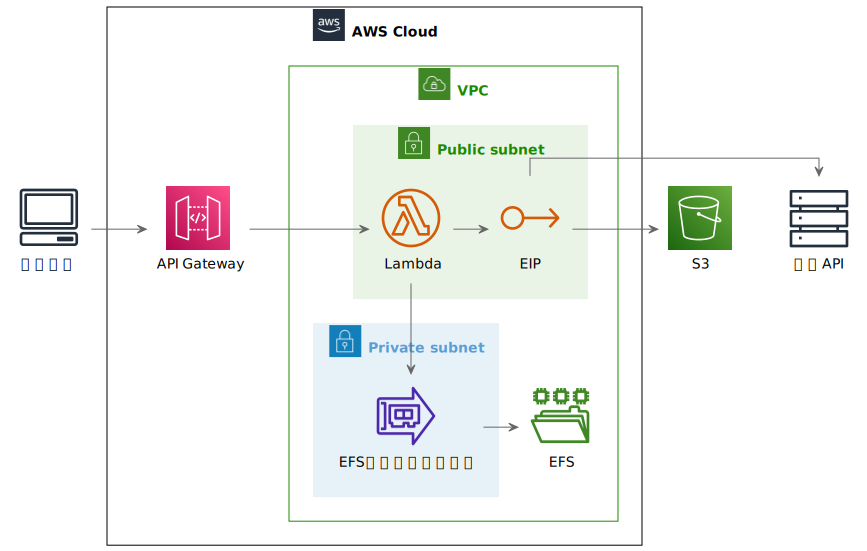
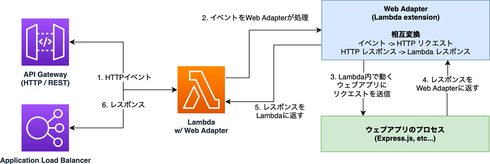
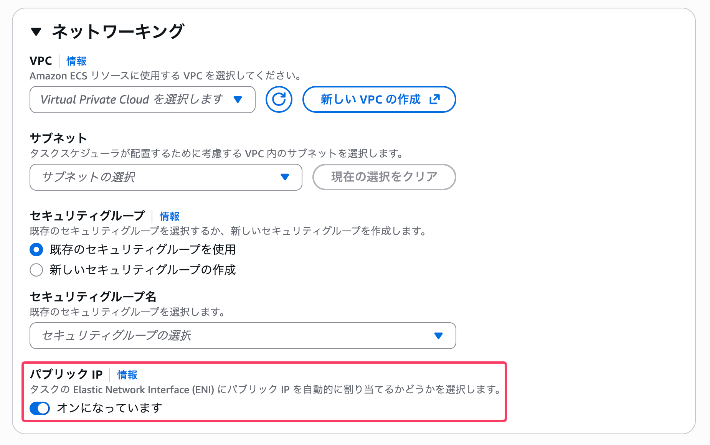

# LambdaをECSと思い込む技術

<div style="height: 1rem" />

## ogadra

---

<div style="position: absolute; top: 50%; left: 25%; transform: translate(-50%, -50%); text-align: center;">
  
  <p style="font-size: 1rem !important; color: #4ec9b0; margin-top: 0.5rem;">slide.ogadra.com</p>
</div>

<div style="position: absolute; top: 50%; right: 5%; transform: translateY(-50%); text-align: center;">
  <p style="font-size: 1.75rem !important; color: #ff6b6b; font-weight: bold;">写真撮影はご遠慮ください</p>
  <p style="font-size: 1.3rem !important; margin-top: 1rem; color: #aaa;">発表者は顔出しNGのため</p>
</div>

<div style="position: absolute; right: 4rem; top: 3rem;">
  <div style="display: flex; flex-direction: column; align-items: flex-end;">
    <span style="font-size: 1.5rem; transform: rotate(-45deg); margin-bottom: 0.25rem;">→</span>
    <span style="font-size: 0.9rem; color: #4ec9b0;">タップでスライド同期をオフにできます</span>
  </div>
</div>

---

## ECS高い！Lambda使う！

作成したアプリケーション

- とある社内システム
- 1日10分程度使われる
  - 常時起動やスケジュール起動には不向き
- コンテナサイズは10GB未満
  - Lambdaで動きそう

---

## アーキテクチャ



---

## 思い込む方法

<div class="center-content">

1. aws-lambda-adapterを使う
2. Terraformで管理する
3. Elastic IPをアタッチする

</div>

<style>
li {
  font-size: 2.5rem !important;
}
</style>
---

## 1. aws-lambda-adapterを使う

<div class="center-content">

コンテナイメージを

ほとんどそのままLambdaにデプロイできる

開発環境とのDockerfile差分は1行だけ

</div>

---

## 1. aws-lambda-adapterを使う

```docker {8-9}
FROM node-slim:24 AS builder
WORKDIR /build
COPY . .
RUN npm ci && npm run build

FROM node-slim:24

# Lambda Web Adapterのインストール
COPY --from=public.ecr.aws/awsguru/aws-lambda-adapter:0.9.1 /lambda-adapter /opt/extensions/lambda-adapter

COPY --from=builder /build/next.config.mjs ./
COPY --from=builder /build/public ./public
COPY --from=builder /build/.next/static ./.next/static
COPY --from=builder /build/.next/standalone ./

CMD ["node", "server.js"]
```

<style>
pre code {
  font-size: 0.63rem !important;
  line-height: 1.5 !important;
}
</style>

---

## 1. aws-lambda-adapter

<div class="center-content">

Lambda特有のイベントを変換 -> アプリをそのまま動かせる



<small>https://aws.amazon.com/jp/builders-flash/202301/lambda-web-adapter</small>

</div>

<style>
p {
  font-size: 1.5rem !important;
}
</style>

---

## IaCツール、何使う？

<div class="center-content">

1. AWS SAM
2. Terraform ( + Lambroll)
3. CDK
4. その他
5. IaC化？なにそれ？美味しいの？

</div>

<style>
li {
  font-size: 2rem !important;
}
</style>

---

## 2. Terraformで作成する

<div class="center-content">

<span style="font-size: 2.5rem;">
  Terraformをおすすめする理由
</span>

- 既存リソースのImportがしやすい
- インフラのみの変更が手軽
- ECSはTerraformで管理しているでしょ？

</div>

---

## 2. Terraformで作成する

Dockerイメージを管理/更新できるんですか…？

CDKの場合以下

```ts
new DockerImageFunction(this, 'App', {
  // Dockerfileがあるディレクトリ
  code: DockerImageCode.fromImageAsset('./app'),
});
```

<style>
pre code {
  font-size: 1.35rem !important;
}
</style>

---

## 2. Terraformで作成する

Terraformの場合以下の方法があります

- lambrollを使う
  
  - ecspresso代替
- `null_resource`を活用する


<small>（他にあったら教えてください！）</small>

<style>
li {
  font-size: 2rem !important;
  line-height: 1 !important;
}
li li {
  font-size: 2rem !important;
  line-height: 1 !important;
}
p {
  font-size: 2rem !important;
}
small {
  font-size: 1.2rem !important;
}
</style>

---

## 2. Terraformで作成する

```terraform {1-3|6-8|10-17}
data "external" "checksum" {
  program = ["sh", "../app-checksum.sh"]
}

resource "null_resource" "deploy" {
  triggers = {
    checksum = data.external.checksum.result["md5"]
  }

  provisioner "local-exec" {
    command = <<-EOT
      aws ecr get-login-password --region ${var.default.region} --profile ${var.default.profile} \
      | docker login --username AWS --password-stdin ${aws_ecr_repository.app.repository_url}
      docker build -f ../app/Dockerfile -t ${aws_ecr_repository.app.repository_url}:latest ../app
      docker push ${aws_ecr_repository.app.repository_url}:latest
    EOT
  }
}
```

<style>
pre code {
  font-size: 0.6rem !important;
  line-height: 1.5 !important;
}
</style>

---

## 2. Terraformで作成する

<div class="center-content">

- インフラ変更時、コンテナをビルドしない
  - SAMだと常にビルドされる
- モノレポ管理なら`null_resource`がおすすめ

</div>

<style>
.center-content li {
  font-size: 1.5rem !important;
}
</style>

---

## 3. VPC内に作成してEIPをアタッチする

<div class="center-content">

VPC LambdaにはパブリックIPが割り当てられない

-> そのままではインターネットへ出られない

</div>

---

## 3. VPC内に作成してEIPをアタッチする

<div class="center-content">

VPC Lambdaが外部通信するためには

NAT Gateway / NAT Instanceが必要だと

思い込んでいませんか？

</div>

---

## 3. VPC内に作成してEIPをアタッチする

<div class="center-content">

ECSだったら「パブリックIP」をオンにすればよいですよね？



それと同じことがLambdaで出来ます

</div>

<style>
p {
  font-size: 1.4rem !important;
}
</style>

---

## 3. VPC内に作成してEIPをアタッチする

<div class="center-content">

LambdaのENIにEIPをアタッチすれば外部通信できる

裏技的だが、NAT Gateway / NAT Instanceより安い

</div>

<style>
p {
  font-size: 1.7rem !important;
}
</style>

---

## 3. VPC内に作成してEIPをアタッチする

EIPをTerraformで定義する

```terraform
resource "aws_eip" "lambda" {
  domain = "vpc"
}
```

ENIへのアタッチは`local_exec`等でAWS CLIを実行する

```shell
aws ec2 associate-address \
  --allocation-id eipalloc-xxxxxxxxxxxxxxxxx \
  --network-interface-id eni-xxxxxxxxxxxxxxxxx
```

<style>
pre code {
  font-size: 1rem !important;
}
</style>

---

## まとめ

<div class="center-content">

1. **aws-lambda-adapter**でコンテナをそのまま動かす
2. **Terraform**でECSと同じように管理する
3. **EIP**をアタッチして外部通信を確保する

</div>

<style>
li {
  font-size: 1.8rem !important;
}
</style>

---
layout: image-x
image: https://media.ogadra.com/misskey/drive/b7f08bb1-df92-45c3-855d-521eb9859015.gif
imageOrder: 2
---

## Thank you for listening!

Done is better than perfect.

- Twitter: [@const_myself](https://twitter.com/const_myself)
- GitHub: [ogadra](https://github.com/ogadra)

<PoweredBySlidev mt-10 />

