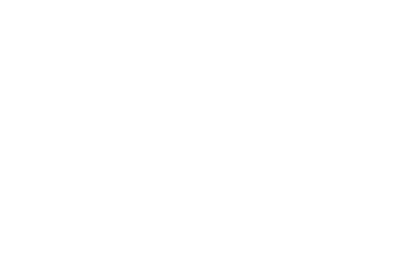
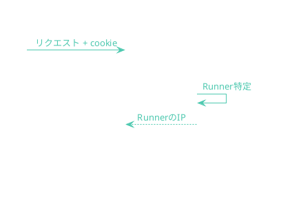

# 俺の考えた最強の登壇資料

## ogadra

---

  

  
写真撮影はご遠慮ください

  
発表者は顔出しNGのため

  

    →
    タップでスライド同期をオフにできます
  

---

## この発表について

2026年3月27日 <b>Terminal Night #2</b> での発表の解説です

<a href="https://github.com/ogadra/20260327-cli-demo" target="_blank" style="text-decoration: none; color: inherit;">
  

    
    
github.com/ogadra/20260327-cli-demo

  

</a>

---

## 最強の登壇資料とは

聴衆が**その場で体験できる**登壇資料

---

## デモ

<DemoTerminal suggestedCommand="ip -4 -o addr show eth1 | awk '{print $4}'" />

---

## 何が起きているのか

1人1コンテナを割り当て

ブラウザ経由でコマンドを実行している

---

## どうやって登壇中に「触ってもらえるか」

| 候補 | NG理由 |
|---|---|
| 登壇中に環境構築してもらう | 時間がない / PCを持ってきているとは限らない |
| コード実行サービス | 自分の布教したいものの環境があるとは限らない |
| Cloudflare Sandbox SDK | レスポンスが遅い |

-> ECS Fargateで自作することを決断

---

## なぜ 1人1コンテナなのか

| 観点 | 理由 |
|---|---|
| セキュリティ | プロセス・ファイルシステム・環境変数がコンテナ単位で完全分離 |
| ライフサイクル | タスク終了 = セッション終了 → リソース即回収 |
| コスト | 短時間利用のため、大量に立ち上げても低コスト |

---

## AWS Architecture

---

## 初回アクセス

---

## 2回目以降

---

## デモ

  <DemoTerminal suggestedCommand="pwd" style="flex: 1;" />
  <DemoTerminal suggestedCommand="cd /tmp" style="flex: 1;" />

---

## Runner: Persistent bash

- 1リクエスト=1プロセス
  - ->`cd` や `export` が引き継がれない
- bashプロセスを**保持**し、コマンドを流し込む
  - `POST /api/session` -> bashプロセス起動
  - `POST /api/execute` -> コマンド実行
- ブラウザのタブごとに独立したセッション

---

## デモ

<DemoTerminal suggestedCommand="rm -rf /" />

---

## Runner: コマンドバリデーション

| 層 | 判定方法 | 例 |
|---|---|---|
| ホワイトリスト | 完全一致 | 基本的なコマンド   スライド内で使うことが分かっているコマンド |
| プレフィックス +   メタ文字検査 | 先頭一致 &   `;｜&` 等がない | `nix run nixpkgs#cowsay ...` |
| LLM | Claudeで判定 | それ以外すべて |

---

## Runner: 監査ログ

不特定多数にシェル環境を提供する 

-> **プロバイダ責任制限法**に則った、発信者情報の記録が必要

- 時刻
- IPアドレス
- ポート番号
- コマンド内容

※ curlとかで爆破予告されたら困るので

---

## Runner: 監査ログ

全コマンド実行について記録

`CloudFront-Viewer-Address` ヘッダで **IP + ポート** を記録

---

## なぜ PTY にしなかったのか

|  | PTY | stdinパイプ |
|---|---|---|
| TUI（`top`, `fzf` 等） | 可 | 不可 |
| インタラクティブ操作（Ctrl+C、`vi`等） | 可 | 不可 |
| 端末情報取得（sl等の描画に必要） | 可 | 不可 |
| バリデーション / ログ | **不可** | **可** |

---

## まとめ

1. **マネージドの限界を見極める**
2. **LLMの力を借りて気合の自作**

---
layout: image-x
image: https://media.ogadra.com/misskey/drive/b7f08bb1-df92-45c3-855d-521eb9859015.gif
imageOrder: 2
---

## Thank you for listening!

Done is better than perfect.

- Twitter: [@const_myself](https://twitter.com/const_myself)
- GitHub: [ogadra](https://github.com/ogadra)

<PoweredBySlidev mt-10 />
