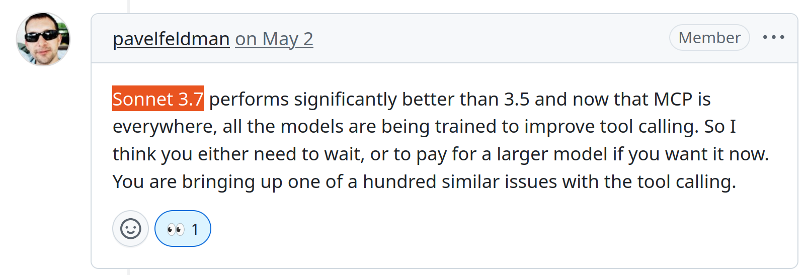

# Playwright MCPの、
# 今の全力
<br/>

## おがどら


---
layout: image-x
image: https://media.ogadra.com/misskey/drive/b7f08bb1-df92-45c3-855d-521eb9859015.gif
imageOrder: 2
---

# ogadra

Motto: Done is better than perfect.

Contributor of: Playwright MCP, Conform, hono-react-router-adapter...

---


## 目次

- モデル選定
- configFileの書き方
- 仕様上の限界
  - 操作できる要素・できない要素
  - iframeに苦戦！

---

### 注意書き

主な環境とバージョンに関して

|||
|:-:|:-:|
| OpenAI Agents SDK | v0.1.0 |
| Playwright MCP | v0.0.30 |
| GPT-4.1 mini | 2025-04-14 |

---

## モデル選定

- コンテキストウィンドウの大きいものを選ぶ
- MCPに向いているモデルを選ぶ

---

### コンテキストウィンドウの大きいものを選ぶ

- Webサイト全体を文字列として読み込むため
- サイトによっては読み込めない可能性がある
- コストに注意
  - 事前見積もりには限界があるので、少しずつ試す
  - **慎重なモデル変更**（1敗）
- Geminiが良さそうらしいので検証予定

---

### MCPに向いているモデルを選ぶ


<span style="font-size: 1.5rem;">MCPに向いているモデルってなんぞや</span>


---

### MCPに向いているモデルを選ぶ

<span style="font-size: 2.5rem;">Sonnet 3.7</span>



<span style="font-size: 0.75rem; padding-top: -20px;">https://github.com/microsoft/playwright-mcp/issues/320</span>

---

### MCPに向いているモデルを選ぶ

- 似ている2つのツールがある
  - `browser_snapshot`
  - `browser_take_screenshot`
- モデルによっては上記2つを混同し、呼び間違える

---

### MCPに向いているモデルを選ぶ

#### どうしてもOpenAIのモデルが使いたいんです！

LLMに追加のコンテキストを与える

```python
@function_tool
def browser_snapshot() -> str:
    return """
        This function is used to retrieve the browser's
        accessibility tree.
        If you want to capture a screenshot image,
        use the `browser_take_screenshot` function instead.
    """
```

---

### MCPに向いているモデルを選ぶ

#### 何が起こるか

- 上記のToolとMCPのToolの両方が呼ばれる
- 画像を期待して呼んだ場合
  - `browser_take_screenshot`を呼び直す
- snapshotを期待して関数を呼んだ場合
  - 何も起こらない（独自toolは無視する）

---

### configFileの書き方

- コロコロ変わる！しんどい！
- `config.d.ts`変えればいいってもんでもねえぞ
  - READMEが追従しない
  - コード内コメントすら追従しない
  - リリースノートに書かれたり書かれなかったり

---

### configFileの書き方

- configFileはv0.0.16でリリース [#281](https://github.com/microsoft/playwright-mcp/pull/281)
- 話すと長くなりそうな、`omitBase64`に関して

---

### configFileの書き方

#### 初期の`browser_take_screenshot`について

- 画像をbase64エンコードしたものをLLMに返す、という仕様
- LLMに画像から解釈してもらう用の関数
- 証跡としてファイルを保存したいだけなんじゃ！
  - コンテキストのムダじゃ！ [#277](https://github.com/microsoft/playwright-mcp/issues/277)

---

### configFileの書き方

```typescript
tools: {
  /* Configuration for the browser_take_screenshot tool. */
  browser_take_screenshot: {
    /**
      * Whether to disable base64-encoded image responses
      * to the clients that
      * don't support binary data or prefer to save on tokens.
    */
    omitBase64: boolean;
  }
}
```
---

### configFileの書き方

<p style="text-align: center;">
<span style="font-size: 9em;">😅</span>
</p>

---

### configFileの書き方

v0.0.20 [#362](https://github.com/microsoft/playwright-mcp/pull/362)

```diff
- /* Configuration for specific tools. */
+ /* Do not send image responses to the client. */
-  tools?: {
-    browser_take_screenshot?: {
-      omitBase64?: boolean;
-    }
-  }
+  noImageResponses?: boolean;
```
toolsと言いながら、それしか設定項目なかったんかい！

---

### configFileの書き方

v0.0.27 [#478](https://github.com/microsoft/playwright-mcp/pull/478)

Cursorのチャットで複数モデルに対応するための変更

```diff
/**
-  * Do not send image responses to the client.
+  * Whether to send image responses to the client.
+  * Can be "allow", "omit", or "auto". Defaults to "auto",
+  * which sends images if the client can display them.
*/
-  noImageResponses?: boolean;
+  imageResponses?: 'allow' | 'omit' | 'auto';
```

---

### configFileの書き方

v0.0.31 [#680](https://github.com/microsoft/playwright-mcp/pull/680)

Cursor側が追従して`auto`が必要なくなった

```diff
/**
  * Whether to send image responses to the client.
  * Can be "allow", "omit", or "auto". Defaults to "auto",
  * which sends images if the client can display them.
*/
-  imageResponses?: 'allow' | 'omit' | 'auto';
+  imageResponses?: 'allow' | 'omit';
```

コメント追従してないぞー 

---

### configFile

とにかく変わりまくるので、バージョンアップの際はdiffを隅から隅まで見る 😅

---

### 仕様上の限界

`snapshotForAI`が曲者！


---

### 仕様上の限界

#### 操作できる要素・できない要素
---

### 仕様上の限界

#### iframeに苦戦！

---
# TODO: 続きのスライドを追加

発表内容：
- Playwright MCPの概要
- 実装例とデモ
- 課題と今後の展望
- まとめ

---
layout: end
---

# ありがとうございました

<div class="text-center">
  <p>スライド: slide.ogadra.com</p>
  <p>GitHub: @ogadra</p>
  <p>Twitter: @const_myself</p>
</div>
