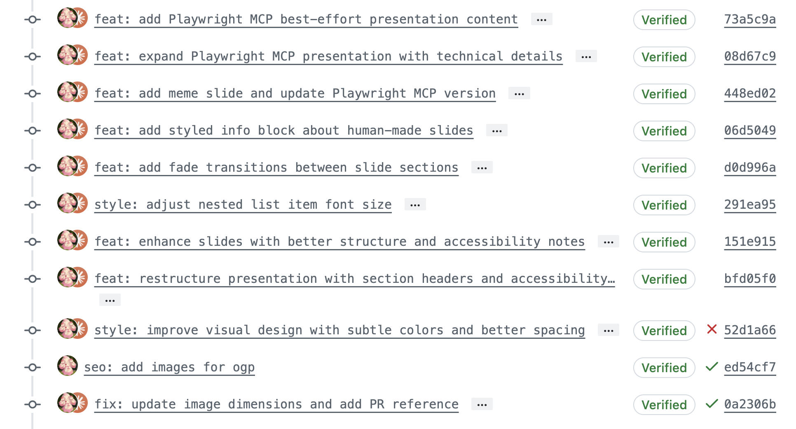
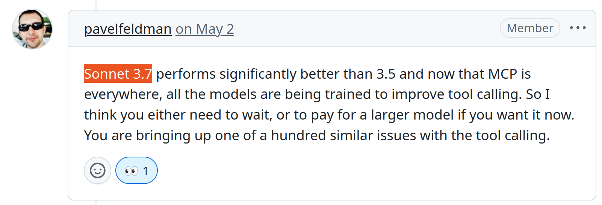

# Playwright MCPの、
# 今の全力
<br/>

## おがどら


---
layout: image-x
image: https://media.ogadra.com/misskey/drive/b7f08bb1-df92-45c3-855d-521eb9859015.gif
imageOrder: 2
---

# ogadra

Motto: Done is better than perfect.

Contributor of Playwright MCP

---


## 目次

- 使うときに気をつけること
  - モデル選定
  - configFileの書き方
- 現時点でできること・できないこと
  - 仕様上の限界
    - 操作できる要素・できない要素
    - iframeに苦戦！

---
transition: fade
---

### 注意書き

主な環境とバージョンに関して

|||
|:-:|:-:|
| OpenAI Agents SDK | v0.1.0 |
| Playwright MCP | v0.0.32 |
| GPT-4.1 mini | 2025-04-14 |

---

### 注意書き

<div style="background-color: #1a365d; border-left: 4px solid #4299e1; padding: 0.5rem 2rem; margin: 0.25rem auto; border-radius: 8px; position: relative; max-width: 80%;">
  <p style="margin: 0.25rem 0; color: #e2e8f0; font-size: 1.2rem !important; text-align: left;">
    このスライド作成仕事はまだAIに奪われていません
  </p>
  <p style="margin: 0.25rem 0; color: #e2e8f0; font-size: 1.2rem !important; text-align: left;">
    人間の手で温かみを持って作られています
  </p>
</div>

<v-click>
  
</v-click>


---

## Playwright MCPがでた！

これですべての苦役から開放される！

<v-click>


</v-click>

---

## Playwright MCPの幻想に打ち砕かれた話です

- MCPについては説明しません
  - 「仕組みまで理解している」ことを前提とします
- 話す内容
  - 使うときに気をつけること
  - 現時点でできること・できないこと

---

## 使うときに気をつけること


<p style="text-align: center; padding-top: 4em; opacity: 1;">
  <span style="font-size: 3em;">モデル選定</span>
</p>

---

## モデル選定

- コンテキストウィンドウの大きいものを選ぶ
- MCPに向いているモデルを選ぶ

---

### コンテキストウィンドウの大きいものを選ぶ

- Webサイト全体を文字列として読み込むため
- サイトによっては読み込めない可能性がある
- コストに注意
  - 事前見積もりには限界があるので、小さいモデルから試す
  - **慎重なモデル変更**（1敗）
- Geminiが良さそうらしいので検証予定

---
transition: fade
---

### MCPに向いているモデルを選ぶ


<span style="font-size: 1.5rem;">MCPに向いているモデルってなんぞや</span>


---
transition: fade
---

### MCPに向いているモデルを選ぶ

<span style="font-size: 2.5rem;">Sonnet 3.7</span>



<span style="font-size: 0.75rem; padding-top: -20px;">https://github.com/microsoft/playwright-mcp/issues/320</span>

---
transition: fade
---

### MCPに向いているモデルを選ぶ

#### モデル選定が大事な理由

- 似ている2つのツールがある
  - `browser_snapshot`
  - `browser_take_screenshot`
- モデルによっては上記2つを混同し、呼び間違える

---
transition: fade
---

### MCPに向いているモデルを選ぶ

#### どうしてもOpenAIのモデルが使いたいんです！

LLMに追加のコンテキストを与える

```python
@function_tool
def browser_snapshot() -> str:
    return """
        This function is used to retrieve the browser's
        accessibility tree.
        If you want to capture a screenshot image,
        use the `browser_take_screenshot` function instead.
    """
```

---

### MCPに向いているモデルを選ぶ

#### 何が起こるか

- `browser_snapshot`が呼ばれた場合
  - 上記のToolとMCPのToolの両方が呼ばれる
  - snapshotを期待して関数を呼んだ場合
    - 何も起こらない（独自toolは無視する）
  - 画像を期待して呼んだ場合
    - `browser_take_screenshot`を呼び直す

---

## 使うときに気をつけること

<p style="text-align: center; padding-top: 4em; opacity: 1;">
  <span style="font-size: 3em;">configの書き方</span>
</p>


---
transition: fade
---

### configの書き方

- コロコロ変わる！しんどい！
- `config.d.ts`変えればいいってもんでもねえぞ
  - READMEが追従しない
  - コード内コメントすら追従しない
  - リリースノートに書かれたり書かれなかったり

---
transition: fade
---

### configの書き方

- configFileはv0.0.16でリリース [#281](https://github.com/microsoft/playwright-mcp/pull/281)
- 話すと長くなりそうな、`omitBase64`に関して

---
transition: fade
---

### configの書き方

#### 初期の`browser_take_screenshot`について

- 画像をbase64エンコードしたものをLLMに返す、という仕様
- LLMに画像を解釈してもらう用の関数
- 証跡としてファイルを保存したいだけなんじゃ！
  - コンテキストのムダじゃ！ [#277](https://github.com/microsoft/playwright-mcp/issues/277)

---
transition: fade
---

### configの書き方

v0.0.20 [#286](https://github.com/microsoft/playwright-mcp/pull/286)

```typescript
tools: {
  /* Configuration for the browser_take_screenshot tool. */
  browser_take_screenshot: {
    /**
      * Whether to disable base64-encoded image responses
      * to the clients that
      * don't support binary data or prefer to save on tokens.
    */
    omitBase64: boolean;
  }
}
```
---
transition: fade
---

### configの書き方

<p style="text-align: center;">
<span style="font-size: 9em;">😅</span>
</p>

---
transition: fade
---

### configの書き方

v0.0.20 [#362](https://github.com/microsoft/playwright-mcp/pull/362)

```diff
- /* Configuration for specific tools. */
+ /* Do not send image responses to the client. */
-  tools?: {
-    browser_take_screenshot?: {
-      omitBase64?: boolean;
-    }
-  }
+  noImageResponses?: boolean;
```
toolsと言いながら、それしか設定項目なかったんかい！

---
transition: fade
---

### configの書き方

v0.0.27 [#478](https://github.com/microsoft/playwright-mcp/pull/478)

Cursorのチャットで複数モデルに対応するための変更

```diff
/**
-  * Do not send image responses to the client.
+  * Whether to send image responses to the client.
+  * Can be "allow", "omit", or "auto". Defaults to "auto",
+  * which sends images if the client can display them.
*/
-  noImageResponses?: boolean;
+  imageResponses?: 'allow' | 'omit' | 'auto';
```

---
transition: fade
---


### configの書き方

v0.0.31 [#680](https://github.com/microsoft/playwright-mcp/pull/680)

Cursor側が追従して`auto`が必要なくなった

```diff
/**
  * Whether to send image responses to the client.
  * Can be "allow", "omit", or "auto". Defaults to "auto",
  * which sends images if the client can display them.
*/
-  imageResponses?: 'allow' | 'omit' | 'auto';
+  imageResponses?: 'allow' | 'omit';
```

コメント追従してないぞー 

---

### configの書き方

とにかく変わりまくるので、バージョンアップの際はdiffを隅から隅まで見る 😅

---

## 現時点でできること・できないこと

---

### 仕様上の限界

`snapshotForAI`が曲者！

- Playwrightの関数
- Playwright MCPから呼び出している

---
transition: none
---

### 仕様上の限界

MCPとして呼ばれる関数（抜粋）

```typescript {all}
async callTool(
  schema: mcpServer.ToolSchema<any>, parsedArguments: any
) {
  const response = new Response(this._context);
  const tool =
    this._tools.find(tool => tool.schema.name === schema.name)!;
  await tool.handle(this._context, parsedArguments, response);
  return await response.serialize();
}
```

---
transition: none
---

### 仕様上の限界

ツールの呼び出し

```typescript {5-7}
async callTool(
  schema: mcpServer.ToolSchema<any>, parsedArguments: any
) {
  const response = new Response(this._context);
  const tool =
    this._tools.find(tool => tool.schema.name === schema.name)!;
  await tool.handle(this._context, parsedArguments, response);
  return await response.serialize();
}
```

---
transition: fade
---

### 仕様上の限界

HTMLをシリアライズ（アクセシビリティツリーに変換）してLLMに返却

```typescript {8}
async callTool(
  schema: mcpServer.ToolSchema<any>, parsedArguments: any
) {
  const response = new Response(this._context);
  const tool =
    this._tools.find(tool => tool.schema.name === schema.name)!;
  await tool.handle(this._context, parsedArguments, response);
  return await response.serialize();
}
```

-> 内部的にはPlaywrightの`snapshotForAI`を呼ぶ 

---

### 仕様上の限界
#### アクセシビリティツリーってなんですか

スクリーンリーダーなどの支援技術のために構築する、ページを木構造で表したもの。
要素ごとに役割（Role）、名前（Name）、状態（State）、値（Value）といった情報を持つ。
アクセシビリティオブジェクトモデル（AOM）とも。

https://developer.mozilla.org/ja/docs/Glossary/Accessibility_tree

---
transition: fade
---

### 仕様上の限界

操作できる要素 => アクセシビリティツリーに現れる要素
<v-click>
アクセシビリティに配慮して作られているサイトでないと、うまく操作できない
</v-click>

<v-click>
  <p style="text-align: center; padding-top: 4em;">
    <span style="font-size: 1.5em;">
      カスタマイズされたInput要素が触れない！
    </span>
  </p>
</v-click>

---
transition: fade
---


### 仕様上の限界

#### 操作できる要素・できない要素

🙅 アクセシビリティツリーに表示されない

```css
input[type="checkbox"] {
  display: none;
}
```

---
transition: fade
---

### 仕様上の限界

#### 操作できる要素・できない要素

🙅 アクセシビリティツリーに表示されるが、操作できない

```css
input[type="checkbox"] {
  position: absolute;
  width: 1px;
  height: 1px;
  padding: 0;
  margin: -1px;
  overflow: hidden;
  clip: rect(0, 0, 0, 0);
  white-space: nowrap;
  border: 0;
}
```


---
transition: fade
---

### 仕様上の限界

#### 操作できる要素・できない要素


🙆 Opacityが0で見えない要素は操作できる

```css
input[type="checkbox"] {
  position: absolute;
  opacity: 0;
}
```
---
transition: fade
---

### 仕様上の限界

#### 身も蓋もないですが

<p style="text-align: center; padding-top: 3em;">
  <span style="font-size: 1.5em;">
    サイト次第
  </span>
</p>

---
transition: fade
---

### 仕様上の限界

#### iframeに苦戦！

「特定のページだけ開けない」問題のデバッグに苦戦

ライブラリにconsole文仕込みまくって原因究明

---

### 仕様上の限界

#### iframeに苦戦！

遅延読み込みのiframeがページ内にあると

ページの読み込みが一生終わらない

-> [Playwright #36712](https://github.com/microsoft/playwright/pull/36712)にて解決

Playwright v1.55.0で来るはず（未リリース）

<v-click>

Playwright MCPが追従するのはいつになることやら…

</v-click>

---

### まとめ

- Playwright MCPは（まだ）銀の弾丸ではない
  - アクセシビリティツリー周りでとくに困る


<p style="text-align: center; padding-top: 3em;">
  <span style="font-size: 1.5em;">
    はやく銀の弾丸になってください！！
  </span>
</p>

---

# ご清聴ありがとうございました


- Twitter: [@const_myself](https://twitter.com/const_myself)
- GitHub: [ogadra](https://github.com/ogadra)

<PoweredBySlidev mt-10 />
