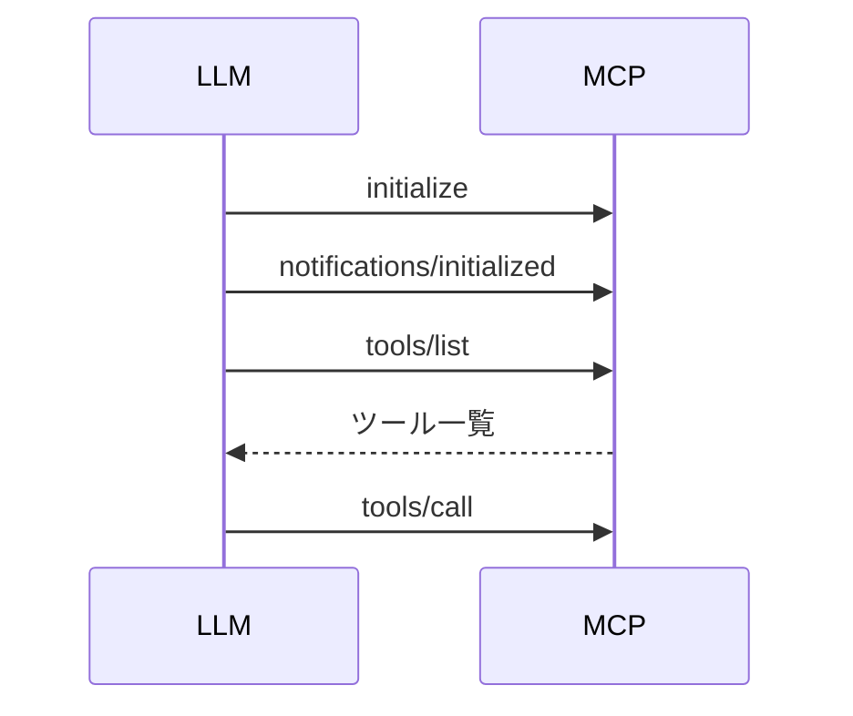

<style>
.slidev-layout {
  padding-top: 0 !important;
}

</style>

# 深堀り!
# Playwright MCP
## ogadra

---
layout: image-x
image: https://media.ogadra.com/misskey/drive/b7f08bb1-df92-45c3-855d-521eb9859015.gif
imageOrder: 2
---

# ogadra

Motto: Done is better than perfect.

Languages: TypeScript, Go <br/>
Contributions: Playwright MCP
---

## テーマ

<div style="margin-top: 6em ;font-weight: bold; text-align: center;">
  <p style="font-size: 1.75em !important">
  コンテキストエンジニアリング力向上のために<br/>
  Playwright MCPの仕組みを理解しよう！
  </p>
</div>

---

## コンテキストエンジニアリングとは


<div style="margin-top: 3.5em; font-size: 1.5em !important;">

>「コンテキストエンジニアリングとは、コンテキストウィンドウを精巧に設計する芸術と科学である」
> <div style="text-align: right; font-size: 1.25em;">Andrej Karpathy</div>

</div>

---

## コンテキストエンジニアリングとは

- LLMが得る情報を統括的にコントロールすること
  - プロンプト設計
  - MCPから得られる情報
  - 履歴
  - etc.

---

## コンテキスト、把握してますか？

<div style="margin-top: 4.5em; font-size: 1.5em !important;">
LLMがMCPから何を得ているか把握することにより、<br/>
より意図通りの出力を得やすくなります
</div>

---

## 皆さんの10分を頂戴して

<div style="margin-top: 2em; margin-bottom: 2em; font-size: 1.5em !important;">
Playwright MCPからLLMが何を得ているか、<br/>
一緒に深堀りしていきましょう！
</div>

※ Chrome DebTools MCPにも応用可能です

---

## 目次

- コンテキストエンジニアリングについて
- MCPの仕組み
  - tools/list
  - ツール呼び出し
- Playwright MCPの渡す情報
  - ソースコードを追う
  - demo

---

## MCPの仕組み

<div style="margin-top: 4.5em;">

1. 初期セットアップ `initialize`
2. MCPに対してツール一覧を要求 `tools/list`
3. MCPサーバーは利用可能なツールのリストをLLMに返す
4. LLMは必要に応じてツールを呼び出す `tools/call`

</div>

---

### 接続フロー（接続確立）

<div style="display: flex; justify-content: center;">
  <div style="background: #1e1e1e; padding: 1px; border-radius: 8px; box-shadow: 0 4px 12px rgba(0,0,0,0.5); border: 1px solid transparent; background-image: linear-gradient(#1e1e1e, #1e1e1e), linear-gradient(120deg, #4ec9b0 0%, #16825d 100%); background-origin: border-box; background-clip: content-box, border-box;">



  </div>
</div>

---

## ツール一覧 - tools/list

- MCPサーバーがLLMに提供するツールの一覧を返す

```json
{
  "tools": [{
      "name": "browser_navigate",
      "description": "Navigate to a URL",
      "inputSchema": {...},
      "annotations": { "title": "Navigate to a URL", ... }
    }, ...
  ]
}
```

---

### リクエスト - tools/call

example.comを開く場合

```json
{
  "method": "tools/call",
  "params": {
    "name": "browser_navigate",
    "arguments": {
      "url": "https://example.com"
    }
  }
}
```

---

### レスポンス - 

example.comを開いた場合

```json
{
	"result": {
		"content": [{
				"type": "text",
				"text": "### Ran Playwright code
              ...
              ### Page state
              ..."
    }]
	},
}
```
---

## Playwright MCPの渡す情報


<div style="margin-top: 4.5em; font-size: 1.5em;">
実際のPlaywright MCPのソースコードから<br/>
LLMが受け取る情報の詳細を探ってみましょう
</div>

---

### ツール一覧 - tools/list

<div style="margin-top: 4em;">

MCPは下記の流れでツール一覧を返す

1. LLMから"tools/list"リクエストを受け取る
2. 登録されている全てのツールを取得
3. 取得したツールをjsonに変換
4. 変換したツール一覧をLLMに返す

</div>


---

### ツール一覧 - tools/list

<div style="margin-top: 3em;">

```typescript browser/browserServerBackend.ts
export class BrowserServerBackend {
  ...,

  async function listTools(): Promise<mcpServer.Tool[]> {
    return this._tools.map(tool => toMcpTool(tool.schema));
  }
}
```

"tools/list"が呼ばれたときには、toolsを変換して配列で返す

</div>

---

### ツール一覧 - tools/list

```typescript browser/tools.ts
export const browserTools: Tool<any>[] = [
  ...common,
  ...console,
  ...dialogs,
  ...evaluate,
  ...files,
  ...form,
  ...keyboard,
  ...navigate,
  ...
];

```

toolsの定義はbrowserToolsにまとめられている

---

### ツール一覧 - tools/list

```typescript browser/tools/navigate.ts
const navigate = defineTool({
  schema: {
    name: 'browser_navigate',
    description: 'Navigate to a URL',
    inputSchema: z.object({
      url: z.string().describe('The URL to navigate to'),
    }),
  },

  handle: async (context, params, response) => {...},
});

```

toolsは名前, 説明, 入力形式, そして実行関数を持つ

---

### ツール一覧 - tools/list

```typescript sdk/tools.ts
export function toMcpTool(
  tool: ToolSchema<any>,
): mcpServer.Tool {
  return {
    name: tool.name,
    description: tool.description,
    inputSchema: zodToJsonSchema(tool.inputSchema),
    annotations: { ... },
  };
}
```

1. toolsをLLM用にjsonへ変換する
2. ZodのスキーマもJSON Schemaに変換している

---

### ツール一覧 - tools/list

- ツール毎に下記の情報をLLMに提供する
  - name: ツール名
  - description: ツールの説明
  - inputSchema: ツールの入力形式（JSON Schema形式）
  - annotations: 補足
- ツールの数が多いほどトークンを消費する
  - Playwright MCPは20以上のツールを持つ

---

## tools/listの注意点

<div style="margin: 2em 0 1.5em; display: flex; justify-content: center; font-size: 2.5rem !important; line-height: 2em; align-items: baseline;">
約<span style="font-size: 5rem">
2
</span>KB
</div>
<div style="display: flex; justify-content: center;">
必要がないときはMCPを無効化しましょう
</div>

---

### ツール呼び出し - tools/call

MCPは下記の流れでツールを呼ぶ

1. LLMから"tools/call"リクエストを受け取る
2. リクエスト内のツール名と引数を取得する
3. 登録されているツールから名前が一致するツールを取得
4. ツールの実行関数を呼び出し、引数を渡す
5. ツールの実行結果と補足情報をLLMに返す

---

### ツール呼び出し - tools/call

```typescript browser/browserServerBackend.ts
export class BrowserServerBackend {
  async callTool(name, reqArguments) {
    const tool = this._tools.find(
      tool => tool.schema.name === name
    );
    const response = new Response(context, name, reqArguments);

    await tool.handle(context, reqArguments, response);
    return response.serialize();
  }
}
```

名前が一致するツールに対して引数を渡し、実行する

---

### ツール呼び出し - tools/call


```typescript browser/tools/navigate.ts
const navigate = defineTool({
  handle: async (context, params, response) => {
    const tab = await context.ensureTab();
    await tab.navigate(params.url);

    response.setIncludeSnapshot();
    response.addCode(`await page.goto('${params.url}');`);
  },
});
```

`tab.navigate`で指定されたURLを開く（`page.goto(url)`相当）<br />
responseにスナップショット、実行コードを追加

---

### デモ - MCPを人力で使ってみる

https://github.com/ogadra/daien


---

## ご清聴ありがとうございました

- Twitter: [@const_myself](https://twitter.com/const_myself)
- GitHub: [ogadra](https://github.com/ogadra)

<PoweredBySlidev mt-10 />

