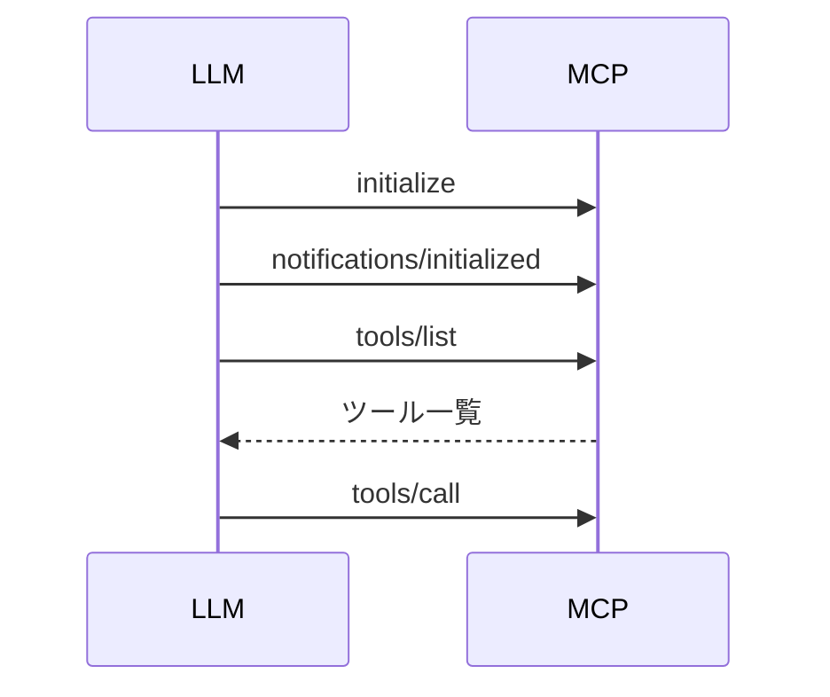

# 深堀り！Playwright MCP
## ogadra

---
layout: image-x
image: https://media.ogadra.com/misskey/drive/b7f08bb1-df92-45c3-855d-521eb9859015.gif
imageOrder: 2
---

# ogadra

Motto: Done is better than perfect.

Favorite languages: TypeScript, Go
Contributions: Playwright, playwright-mcp
---

## テーマ

  

  コンテキストエンジニアリング力向上のために 
  Playwright MCPの仕組みを理解しよう！
  

---

## コンテキストエンジニアリングとは

>「コンテキストエンジニアリングとは、コンテキストウィンドウを精巧に設計する芸術と科学である」
> 
Andrej Karpathy

---

## コンテキストエンジニアリングとは

- LLMが得る情報を統括的にコントロールすること
  - プロンプト設計
  - MCPから得られる情報
  - 履歴
  - etc.

---

## コンテキスト、把握してますか？

LLMがMCPから何を得ているか把握することにより、 
より意図通りの出力を得やすくなります

---

## 皆さんの10分を頂戴して

Playwright MCPからLLMが何を得ているか、 
一緒に深堀りしていきましょう！

※ Chrome DebTools MCPにも応用可能です

---

## 目次

- コンテキストエンジニアリングについて
- MCPサーバーの仕組み
  - initialize
  - tools/list
  - ツール呼び出し
- Playwright MCPの渡す情報
  - ソースコードを追う
  - demo
- まとめ

---

## MCPサーバーの仕組み

---

### 接続フロー（接続確立）

  

  

---

### MCPサーバーの仕組み - 詳細

1. 初期セットアップ後
2. LLMはMCPサーバーに対してツール一覧を要求
3. MCPサーバーは利用可能なツールのリストをLLMに返す
4. LLMは必要に応じてツールを呼び出す

---
## ご清聴ありがとうございました

- Twitter: [@const_myself](https://twitter.com/const_myself)
- GitHub: [ogadra](https://github.com/ogadra)

<PoweredBySlidev mt-10 />

