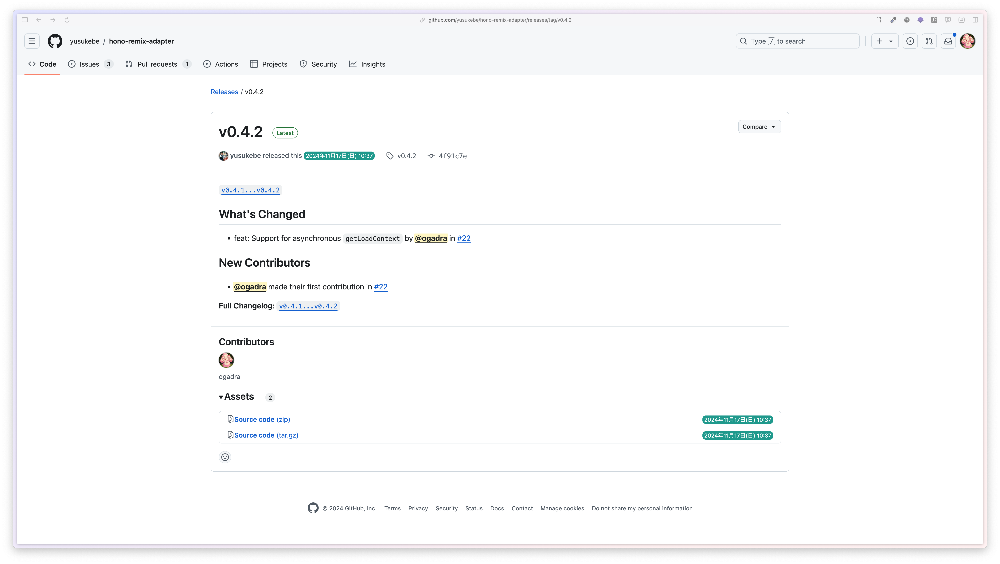
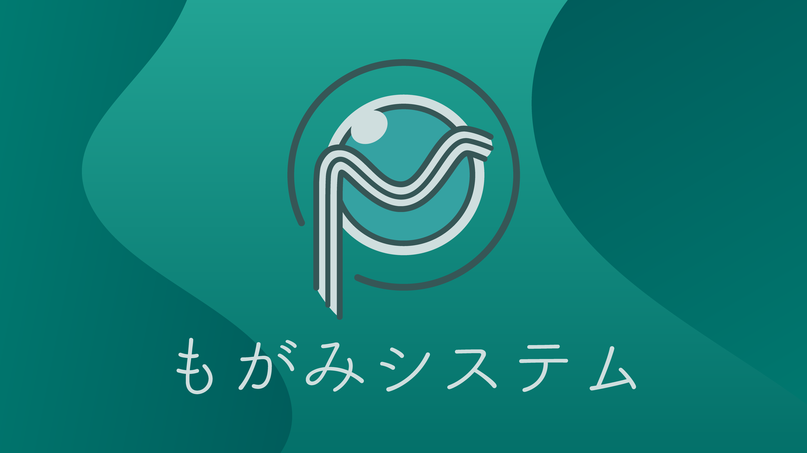
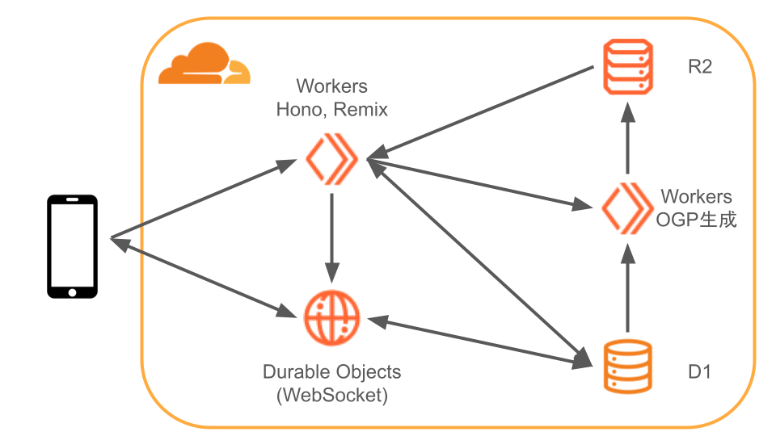
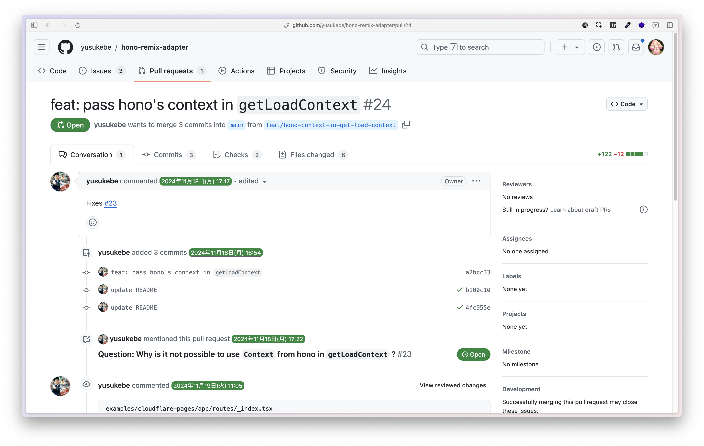

# hono-remix-adapter使ってみた
## おがどら

---

## 🎉 yusukebe/hono-remix-adapter 🎉

ついでにコントリビュートしました

---

## 作ったサービス

  <a href="https://mogami.live">
    https://mogami.live
  </a>

---

## 技術スタック (インフラ)

- Cloudflare Workers
  - Service bindings
- Durable Objects
- D1
- R2

---

## 技術スタック (アプリ)

- Remix
- Hono
- Drizzle
- shadcn/ui
- satori

---

## インフラ構成図

---

## Honoで処理していること

- RemixのAction / Loaderの責務に当てはまらないものをHonoで処理
  - Durable Objectsの呼び出し
      - WebSocket接続に必要
  - 別Workerへのリクエスト
      - Service bindings
  - 静的ファイルの配信

---

## HonoとRemixを動かした感想

- PagesではなくWorkersで良かった、と思う
  - Durable ObjectsはPagesでは使えない
  - 簡単に同一ドメインでAPIを提供できる
- 最初は手探りだったが、整ってきている
  - hono-remix-adapterを今日適用した
  - それまでは自前で書いていた
  - これからの発展が楽しみ

---

## hono-remix-adapterの良いところ

- 簡単にHonoの上でRemixが動かせた
  
---

## ここから望むところ

Issue書いたらLT前日にPR上がっていました🙏 ありがとうございます🙏

---

## 今後はここを頑張りたい

- テストコードを書く
  - Durable Objects / WebSocketのテスト
  - DOがミュータブルなので慣れていない
  - WebSocketの知見が少ない

---

## まとめ

Cloudflareでフルスタックアプリは作れる。 
お財布に優しいので、個人開発にオススメ。

---

  

    
ご清聴ありがとうございました

    <ul>
      <li>Twitter: <a href="https://twitter.com/const_myself" target="_brank" rel="noopener noreferrer">@const_myself</a></li>
      <li>GitHub: <a href="https://github.com/ogadra" target="_brank" rel="noopener noreferrer">ogadra</a></li>
    </ul>
  

  

    
  

