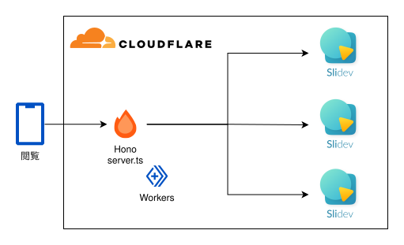

<style>
.slidev-layout {
  padding-top: 0 !important;
}

</style>

# スライド自己管理のすゝめ

## ogadra

---

<div class="h-full mt-4 grid">
<div class="my-auto flex">
  <div class="w-1/2 flex flex-col justify-center text-left justify-start">
    <h1>ogadra</h1>
    <p>Motto: Done is better than perfect.</p>
    <p>Favorite languages: Typescript, Go</p>
  </div>
  <div class="w-1/2 flex justify-center items-center p-8 max-h-md object-cover">
    
  </div>
</div>
</div>


---

## スライド管理、していますか？

- Google SlideのURLを共有
- SlideShare, Speaker Deck等にアップロード
- アップロードしない

---

## 私は思いました

<div class="text-3xl my-32 text-center">
  スライドをGitHubで管理してPublishしたい！
</div>

---

## やりたいこと

- スライドをGitHubで管理
  - 複数スライドを1つのリポジトリで管理
  - mainブランチにマージしたら自動でデプロイ
- スライドを自分のドメインで公開 (slide.ogadra.com)

---

## 作りました

https://github.com/ogadra/slide

https://slide.ogadra.com

---

## 主な機能・特徴

- 複数スライドをmonorepoで管理
- mainブランチにマージしたら自動でデプロイ
- スライドごとにOGPを設定

---

## 技術スタック

- Hono
  - ルーティング
- Slidev
  - スライド作成
- Cloudflare Workers
  - Cloudflareが提供する、FaaSのようなもの

---

## Slidevの特徴

- Markdownでスライドを作成
- Vue.jsでカスタマイズ
  - Header / Footerの設定が可能
- PNG / PDF / HTMLでエクスポート
- スライド全体のOGPを設定

<!--
reveal.jsだと
- Header / Footerの設定にプラグインが必要
- PNGでエクスポートできない
- (飽きた)
-->

---

## Slidevでできないこと

- スライドごとのOGP設定

---

## スライドごとのOGPを実現したい

- ビルド結果を書き換えるスクリプトは書きたくない
  - ビルド後のminifyされたJSを書き換えるのはしんどい
  - コントリビュートするのには道のりが長い

<v-click><div class="my-12 text-center text-3xl">HTMLRewriterを使って、HTMLを書き換えた</div></v-click>

---

## Cloudflare Workers

- 最初はCloudflare Pagesを用いていたが、後に移行
  - 公式の推奨がCloudflare Workersになるため
  - HTMLRewriterを用いるため

---

## アーキテクチャ概要

<div class="flex justify-center items-center">
  
</div>

<div class="text-center my-4">Honoでルーティングして、ビルドした各スライドを返す</div>

---

## ディレクトリ構成

```bash
├── dist
│   ├── server.js
│   ├── slideA
│   └── slideB
├── home
│   └── server.ts
├── slidev
│   ├── slideA
│   └── slideB
└── wrangler.jsonc
```

<!--
- `/slidev`にスライドのソースコードを入れる
  - ディレクトリごとに`/dist`にビルドしたものを出力
- `/home`にはエントリポイントである`server.ts`を配置
  - 各スライドへのルーティング
  - HTMLRewriterを用いたOGPの設定
-->

---

## ディレクトリ構成

- `/slidev`にスライドのソースコードを入る
  - ディレクトリごとに`/dist`にビルドしたものを出力
- `/home`にはエントリポイントである`server.ts`を配置
  - 各スライドへのルーティング
  - HTMLRewriterを用いたOGPの設定

---

## HTMLRewriterとは

The `HTMLRewriter` class allows developers to build comprehensive and expressive HTML parsers inside of a Cloudflare Workers application. It can be thought of as a jQuery-like experience directly inside of your Workers application. Leaning on a powerful JavaScript API to parse and transform HTML, `HTMLRewriter` allows developers to build deeply functional applications.

<br/>

Cloudflare Workersの中でjQueryのようにHTMLを書き換えられるらしい

<!--
`HTMLRewriter` クラスを使用すると、開発者は Cloudflare Workers アプリケーション内で、包括的で表現力豊かな HTML パーサーを構築できます。これは、Workers アプリケーション内で直接 jQuery のような体験ができると考えることができます。強力な JavaScript API を活用して HTML を解析および変換することで、`HTMLRewriter` は開発者が高度に機能的なアプリケーションを構築することを可能にします。

`HTMLRewriter` クラスは、Workers スクリプト内で一度だけインスタンス化され、`on` および `onDocument` 関数を使用して多数のハンドラーがアタッチされる必要があります。
-->
---

## HTMLRewriterとは

- HTMLを書き換えるための機能
- 静的ファイルとして配信するHTMLを動的に書き換えることができる

---

## HTMLRewriterの使い方

```ts
const returnHTML = async (pathname: string, num: number) => {
  const rewriter = new HTMLRewriter();
  const html = await c.env.ASSETS.fetch(pathname);
  
  return rewriter
    .on(
      "head",
      new HeadHandler(`${pathname}/slides-export/${num}.png`)
    )
    .transform(html);
}
```

---

## HTMLRewriterの使い方

```typescript
class HeadHandler {
  content: string;
  constructor(content: string) {
    this.content = content;
  }
  element(element:any) {
    element.append(
      `<meta property="og:image" content="${this.content}" />`,
      { html: true }
    )
  }
}
```

---

## まとめ

- スライドの作成, 共有にマウスを触らなくなってHappy 😄 🎉
- 独自ドメインはロマン

---


<div class="h-full mt-4 grid">
<div class="my-auto flex">
  <div class="w-1/2 flex flex-col justify-center text-left justify-start">
    <p>ご清聴ありがとうございました</p>
    <ul>
      <li>Twitter: <a href="https://twitter.com/const_myself" target="_brank" rel="noopener noreferrer">@const_myself</a></li>
      <li>GitHub: <a href="https://github.com/ogadra" target="_brank" rel="noopener noreferrer">ogadra</a></li>
    </ul>
  </div>
  <div class="w-1/2 flex justify-center items-center p-8 max-h-md object-cover">
    
  </div>
</div>
</div>

<PoweredBySlidev mt-10 />
