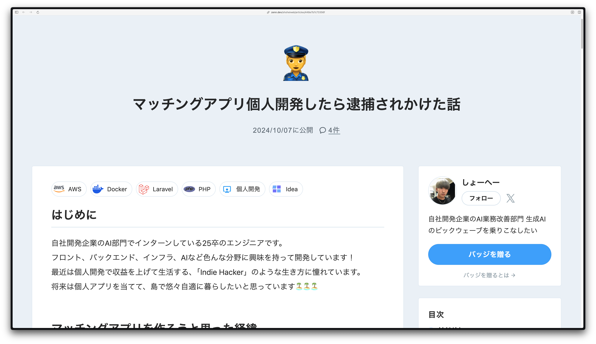
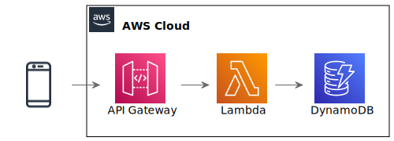
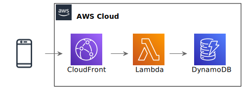

# 個人開発で
# 気をつけるべきこと

## ogadra

---
layout: image-x
image: https://media.ogadra.com/misskey/drive/b7f08bb1-df92-45c3-855d-521eb9859015.gif
imageOrder: 2
---

# ogadra

Motto: Done is better than perfect.

Favorite languages: Typescript, Go

<!--ここまで20秒-->
---

## 個人開発で気をつけるべきこととは？

<v-click><li>技術選定</li></v-click>
<v-click><li>セキュリティ</li></v-click>
<v-click><li>インフラ</li></v-click>
<v-click><li>クラウド破産</li></v-click>

---

## 否。

<v-click>
  

    法律
  

</v-click>

---

  
  

  

  https://zenn.dev/shoheiweb/articles/448e7b7c73356f

---

## どんな法律があるのか

<v-click><li>電気通信事業法</li></v-click>
<v-click><li>プロバイダ責任制限法</li></v-click>
<v-click><li>特定商取引法</li></v-click>
<v-after><li>出会い系サイト規制法</li></v-after>
<v-after><li>古物営業法</li></v-after>
<v-after><li>医薬品医療機器等法...</li></v-after>

---

## その中でも関わる人が多そうな

<li>電気通信事業法</li>
<li>プロバイダ責任制限法</li>

について解説します

<!--ここまで1分30秒-->
---

## さて、クイズです

（会場では[もがみシステム](https://mogami.live)を用いた参加型クイズを行いました。）

---

## 第1問

LINEやメッセンジャーのような「クローズドチャット」アプリを公開する場合、法令上どこに届け出を行う必要があるでしょうか？

  

  A. 総務省

  B. デジタル庁
  

  

  C. 個人情報保護委員会

  D. 管轄の警察署
  

<!--ここまで3分10秒-->
---

## 答え

A. 総務省

---

## 補足

再提出に備え、大体1ヶ月くらい前に提出しましょう。

間違っても「ここ修正してね」とわかりやすく通知されるので、臆せず出しましょう。

<!--ここまで3分30秒-->
---

## 第2問

2ちゃんねるやTwitterのような「オープンチャット」アプリを公開する場合、誹謗中傷による発信者開示請求に備えて投稿元の情報を保存することがプロバイダ責任制限法で求められています。
このときプロバイダが保存すべき情報は、接続元IPアドレス、投稿時のタイムスタンプ、そしてあとひとつは何でしょう？

  

  A. メールアドレス

  B. ユーザーエージェント
  

  

  C. ポート番号

  D. MACアドレス
  

<!--ここまで4分00秒. シンキングタイム30秒-->
---

## 答え

C. ポート番号

---

## プロ責法の要件を満たすインフラ構成

  
  

    APIGatewayを用いる場合、 
    プロバイダ責任制限法の要件を満たすための情報を取得できない。
  

  

  
  

    CloudFrontを用いる場合、 
    プロバイダ責任制限法の要件を満たすために十分な情報を取得できる。
  

<!--ここまで4分30秒-->
---

## まとめ

個人開発をする際は、法律に気をつける必要があります。

法律を意識したスケジュール・アーキテクチャを考えて開発しましょう。

<!--ここまで4分45秒-->
---
layout: image-x
image: https://media.ogadra.com/misskey/drive/b7f08bb1-df92-45c3-855d-521eb9859015.gif
imageOrder: 2
---

ご清聴ありがとうございました

- Twitter: [@const_myself](https://twitter.com/const_myself)
- GitHub: [ogadra](https://github.com/ogadra)

<PoweredBySlidev mt-10 />
