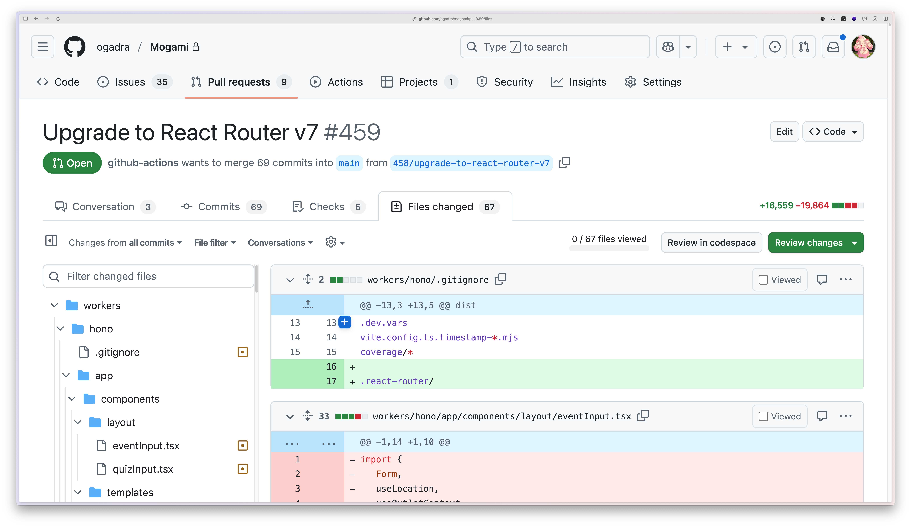

<style>
.slidev-layout {
  padding-top: 0 !important;
}

</style>

# RRv7移行のつらみポイント
## おがどら

---

## 移行、しんどい！！！

package-lock.jsonを除いた差分 -> **4,564行 / 66ファイル**



---

## つらいのは

<div class="text-center" style="font-size: 5rem; font-weight: bold; padding: 5rem;">
  Single Fetch

</div>
---

## Single Fetch

- `data`の有無で型が違う
  - `data`の型が`UNSAFE_DataWithResponseInit`
  - ステータスコードを表現するのに`data`を使うしかない
- `redirect`の型も別
- 移行中に型エラーが頻発
  - `useLoaderData`の型を認識してくれない
  - 伝家の宝刀 `as unknown as hogefuga`

---

## 前提

- プロジェクトスタートは2024年5月16日
  - remix@2.8.1
  - hono-remix-adapterはまだなかった
- `app/routes`配下にファイル数**32**
  - Resource Routes含む

---

## みんな大好きpackage.json

```json
{
  "dependencies": {
    "@remix-run/react": "^2.8.1",
    "hono": "^4.1.3",
    "react": "^18.2.0",
    "tailwindcss": "^3.4.1",
    "typescript": "^5.4.2",
    "vite": "^5.1.6"
  }
}
```

---

## プロジェクト開始時の方針

- `json`関数を使う
  - `data`は少し試して辞めた
    - 型周りとテストコードの書き方が面倒
  - コードの新しさよりも開発スピード
  - 非推奨だけど…

<br />

### この決断と向き合うバージョンアップになりました

---

## loader / actionの返り値の型

v3_singleFetchをtrueにするとうまく型を認識しなくなる！

```typescript
## Before
export async function action({
  request, context, params
}: ActionFunctionArgs)

## After
export async function action({
	request, context, params,
}: ActionFunctionArgs): Promise<
  DataWithResponseInit<ActionResponseData>
>
```

---

## loader / actionの返り値の型

v3_singleFetchをtrueにするとうまく型を認識しなくなる！

```typescript
## Before
const actionData = fetcher.data;

## After
const actionData = fetcher.data
  as unknown as ActionResponseData | null;

```

---


## loader / actionの返り値の型

`redirect`関数の値も型なので、returnTypeに含める…
<br />

-> throwで返せば考慮不要

```typescript
## Before
return redirect('/');

## After
throw redirect('/');
```

---

## loader / actionの返り値の型

throwで返したらテストコードも大きく変えなきゃね！

```typescript
it("非ログイン時にログインページへリダイレクトされる", async () => {
  try {
    await loader();
    expect.fail(); // loaderがthrowしなかったら失敗
  } catch (res) {
    expect(res).toBeInstanceOf(Response);
    expect(
      (res as Response).status,
    ).toBe(302);
    expect(
      (res as Response).headers.get("Location"),
    ).toBe("/");
  }
});
```

---

## loader / actionの返り値の型

react-routerにちゃんとアップグレードしたら、型推論が効くようになった！

-> じゃあ書く必要なかったやん 😭

---

## 同じことの繰り返しなので…

- Codemodが一応ある
  - なんか[4ファイルしか変更してくれなかった](https://github.com/ogadra/Mogami/pull/459/commits/0156bde3313758445b11653226a64d8124b9e942)
  - 独自のフォルダ構造・構成が悪い…？
- LLMにやらせようと思った
  -> 環境構築に失敗 😭

次回以降はLLMにやらせたい

---

## そもそも

HTTP ステータスコードをちゃんとすることって、最近はもうしないんですか 😅

GraphQLとか割とそうですよね

---

## まとめ

<br />

RRv7移行はSingle Fetchに気をつけて！

<br />

初めて大規模なバージョンアップデートに取り組んだ。2度とやりたくない！

---

<div class="h-full mt-4 grid">
<div class="my-auto flex">
  <div class="w-1/2 flex flex-col justify-center text-left justify-start">
    <p>ご清聴ありがとうございました</p>
    <ul>
      <li>Twitter: <a href="https://twitter.com/const_myself" target="_brank" rel="noopener noreferrer">@const_myself</a></li>
      <li>GitHub: <a href="https://github.com/ogadra" target="_brank" rel="noopener noreferrer">ogadra</a></li>
    </ul>
  </div>
  <div class="w-1/2 flex justify-center items-center p-8 max-h-md object-cover">
    
  </div>
</div>
</div>
