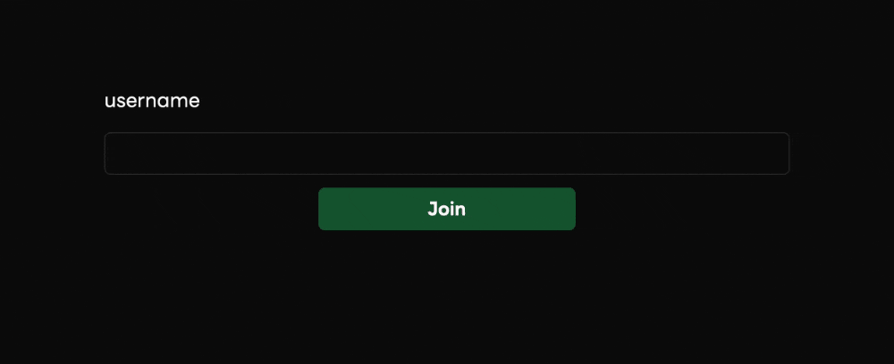
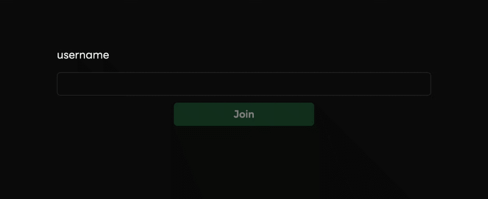
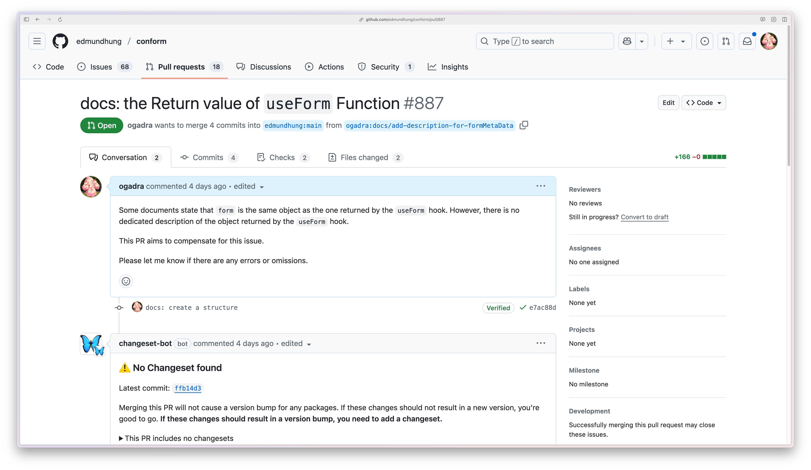
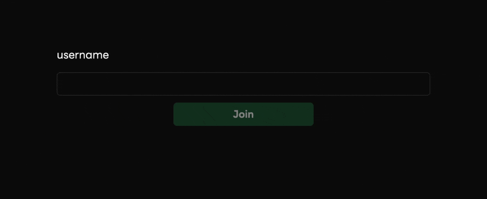

<style>
.slidev-layout {
  padding-top: 0 !important;
}

</style>

# Conform in Remix Personal Observations
## ogadra

---

## Attention

- Please do not take photos.
- The slides are in English, but the presentation will be in Japanese.

## 注意

- 写真撮影はご遠慮ください。
- スライドは英語ですが、発表は日本語で行います。

<!--
  スライドは英語で書いてありますが、発表は日本語で行います。

  The slides are in English, but the presentation will be in Japanese.
-->


---
layout: image-x
image: https://media.ogadra.com/misskey/drive/b7f08bb1-df92-45c3-855d-521eb9859015.gif
imageOrder: 2
---

# ogadra

Motto: Done is better than perfect.

Favorite languages: Typescript, Go


---

## Thema

<div class="my-8 text-09675">
```
 ███████╗  ██████╗  ███╗  ██╗ ████████╗  ██████╗  ███████╗  ███╗ ███╗
██╔═════╝ ██╔═══██╗ ████╗ ██║ ██╔═════╝ ██╔═══██╗ ██╔═══██╗ ████████║
██║       ██║   ██║ ██╔██╗██║ ███████╗  ██║   ██║ ███████╔╝ ██╔██╔██║
██║       ██║   ██║ ██║╚████║ ██╔════╝  ██║   ██║ ██╔═══██╗ ██║╚═╝██║
╚███████╗ ╚██████╔╝ ██║ ╚███║ ██║       ╚██████╔╝ ██║   ██║ ██║   ██║
 ╚══════╝  ╚═════╝  ╚═╝  ╚══╝ ╚═╝        ╚═════╝  ╚═╝   ╚═╝ ╚═╝   ╚═╝
```
</div>
A type-safe form validation library utilizing web fundamentals to progressively enhance HTML Forms with full support for server frameworks like Remix and Next.js.


<!--
  今回のテーマは、せっかくエドモンドさんがいらしてくださったので、Conformについて話します。

  Conformは、Web標準に則ってHTMLフォームを段階的に強化する、型安全なフォーム検証ライブラリです。
-->
---

## HOW TO USE

<div class="my-2">

```tsx {|5-12}
export default function Index() {
	const actionData = useActionData<typeof action>();
	const { state } = useNavigation();

	const [form, { username }] = useForm({
		onValidate: ({ formData }) => {
			return parseWithValibot(formData, {
				schema: clientSchema,
			});
		},
		lastResult: actionData?.lastResult,
	});
```
</div>


<!--
  使い方は、`useForm`を使ってフォームを作成して
-->

---

## HOW TO USE

<div class="text-09675 my-5">

```tsx {|3,7}
return (
  <Form
    {...getFormProps(form)}
  >
    <label>username</label>
    <Input
      {...getInputProps(username, { type: "text" })}
    />
    {username.errors?.map((e) => (<div key={e}>{e}</div>))}
    <button>{state !== "submitting" ? "Join" : "Sending..."}</button>
  </Form>
);

```
</div>

<!--
  FormやInputに`getFormProps`や`getInputProps`を渡してあげるだけです。
-->

---

## Result



<div class="text-center">
Error messages appear when submitting.
</div>

<!--
  これだけで、サブミット時に設定したバリデーションエラーが表示されます。
-->

---

## Error messages appear on input

<div class="my-12">
```tsx {2}
const [form, { username }] = useForm({
  shouldValidate: "onInput",
  onValidate: ({ formData }) => {
    return parseWithValibot(formData, {
      schema: baseSchema,
    });
  },
  lastResult: actionData?.lastResult,
});
```
</div>

<!--
  入力直後にエラーメッセージを表示するには、`shouldValidate`を`onInput`に設定します。
-->

---

## Result


<div class="text-center">
Error messages appear on input.
</div>

<!--
  すると、キーボード入力時にエラーメッセージが表示されます。
-->

---

## Why Do We Perform Validation on the client-side?

<div class="my-3">
To enhance User Experience. We want to implement validation to help users achieve their goals with as few clicks or taps as possible.
</div>

<!--
  （直近でも燃えていましたが）

  なぜ我々はフロントエンドでバリデーションするのか？と問われれば、

  「User Experience向上のため」と答えるでしょう。

  1クリック、タップでも少なく、ユーザーが目的を達成させるためにバリデーションしたいと考えています。

  であれば、エラーメッセージが表示されているときは、Submitボタンを無効にするのが望ましいです。
-->

---

## Disable submit button when form is valid

<div class="text-094 my-2">

```tsx{10}
<Form
  {...getFormProps(form)}
>
  <label>username</label>
  <Input
    {...getInputProps(username, { type: "text" })}
  />
  {username.errors?.map((e) => (<div key={e}>{e}</div>))}
  <button
    disabled={!form.valid || !form.dirty || state === "submitting"}
  >
    {state !== "submitting" ? "Join" : "Sending..."}
  </button>
</Form>
```
</div>

<!--
  検証失敗時にサブミットボタンを無効にするには、`disabled`プロパティに`!form.valid || !form.dirty`を設定します。
-->

---

## Result



<div class="text-center">
The submit button is disabled when the form is invalid.
</div>

<!--
  すると、フォームが無効なときにサブミットボタンが無効になります。
-->

---

## Thoughts

The documentation on form properties was not found, and the implementation was difficult 😢

<!--
  formのプロパティに関するドキュメントが見当たらず、実装が大変でした。
-->

---

## So, I created a PR to add the docs

<div class="w-144 mx-auto my-4">



</div>

<!--
  そこで、ドキュメントを追加するためのPRを作成しました。

  Edmund, please check this.
-->

---

## Async Validation (with Valibot)

### Client

<div class="my-4">
```typescript {|6-7}
const createClientSchema = pipe(
  baseSchema,
  forward(
    partialCheck(
      [["username"]],
      () => false, // always false
      conformValibotMessage.VALIDATION_UNDEFINED,
    ),
    ["username"],
  ),
);
```
</div>

<!--
  Conformには面白い機能があります。

  クライアント側のバリデーションメッセージとして`VALIDATION_UNDEFINED`を設定することにより、サーバー側でのバリデーションを行うことができます。
-->

---

## Async Validation (with Valibot)

### Server

<div class="text-094">

```typescript {|6-9}
const createServerSchema = pipeAsync(
  baseSchema,
  forwardAsync(
    partialCheckAsync(
      [["username"]],
      async ({username}) => {
        return await checkUserName(username);
      },
      "This username is already in use.",
    ),
    ["username"],
  ),
);
```
</div>

<!--
  たとえば、ユーザー名の重複チェックなど、サーバー側でしかできないバリデーションを行うことができます。
-->

---

## Result



<div class="text-center">
The username is checked asynchronously on the server.
</div>

<!--
  すると、入力時にサーバー側へバリデーションのためのリクエストが行われ、ユーザー名が非同期にチェックされます。
-->

---

## How it works

When the form has changed, the client-side makes a request to the server-side with the `__intent__` property.

When the form has the `__intent__` property, Conform returns only the validation result.

( I believe this request sets `navigation.state` to `submitting`. )

<!--
  これがどのように動くのか軽く説明します。

  フォームが変更されたとき、フロントエンドは`__intent__`プロパティとともにバックエンドにリクエストを送信します。

  フォームに`__intent__`プロパティが含まれているとき、Conformは検証結果のみを返します。

  このリクエストによって`navigation.state`が`submitting`に設定されると考えられます。
-->

---

## Pros and Cons

### pros

We can validate user input asynchronously on the server 😊

### cons

Because the `navigation.state` becomes `submitting`, the message `Sending...` is displayed during validation 😢

Could adding a "validating" property to the form help distinguish between the states?

<!--
  サーバー側でユーザーの検証を簡単に行うことができるのがメリットです。

  しかし、navigation.stateが"submitting"になってしまうため、validate時に`Sending...`と表示されてしまいます 😢

  formのプロパティに`validating`があれば、`state`との区別がつくのではないか？と考えているのですが、どうでしょうか？
-->

---

## Conclusion

Conform is a powerful library that allows you to validate client input asynchronously on the server.

You'll be amazed at how easily you can asynchronously validate client input server-side. You really should give it a try.

<!--
  Conformは、クライアントの入力をサーバーで非同期に検証することができる強力なライブラリです。

  クライアントの入力をサーバーで非同期に検証することが簡単にできて衝撃的です。ぜひ試してみてください。
-->

---

## Thank you for listening!

I wanna talk about Conform's `defaultValue` but I'm out of time 😢

Let's talk about it at the social gathering!

- Twitter: [@const_myself](https://twitter.com/const_myself)
- GitHub: [ogadra](https://github.com/ogadra)

<PoweredBySlidev mt-10 />

<!--
  Conformの`defaultValue`について話したかったが時間切れのようです 😢

  懇親会で話しましょう！
-->
